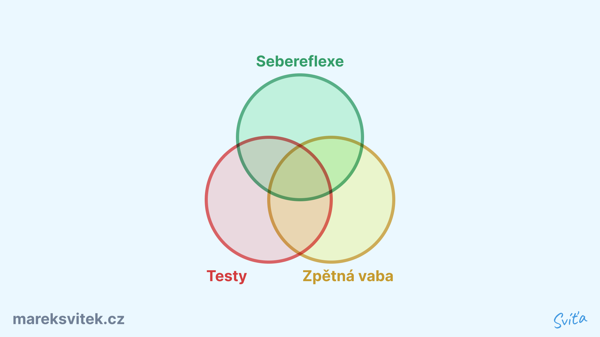

## Obecná teorie
- Talenty a silné stránky nám odpovídají na otázku "Co mám a ostatní ne?"
- Proč si často myslíme, že žádné nemáme?
	- Protože to co umíme, vidíme jako normu a samozřejmost
- V různých situacích se projevují jiné talenty
### Talenty jako strategický plán
 - **Hodnoty** nám říkají **proč** a co dělat (kompas k cíli)
- **Talenty** nám říkají **jak** to udělat nejlehčeji (mapa k cíli)
- Talenty jsou strategický plán pro uskutečnění projektu
### Důležitost sebepoznání
- Proč je důležité je znát?
	- Lehčí život s menším úsilím
	- Budeme vědět, jak kompenzovat naše slabiny
	- Nemusíme se bát o budoucnost naší práce
		- Když přeskládám použití talentů, dostanu novou práci, která mi půjde a budu v ní výjimečný
### Talent x silná stránka
- **Talent** - způsob myšlení, chování, cítění pro nás přirozený
- **Silná stránka** - schopnost vytvářet pozitivní výsledek v konkrétních úkolech

> [!note] 
> Talent × úsilí = silná stránka

### Slabé stránky
- Často podceňujeme jejich důležitost, protože vnímáme, že důležité jsou jen ty naše silné stránky. Slabé stránky se nám zdají nedůležité, nevidíme jaký mohou mít benefit tyto stránky (protože jsme ho nikdy nepociťovali).
- U slabých stránek je potřeba dělat damage control, aby nám neškodily:
	1. Nástroji a metodami
	2. Spolupráci s ostatními
	3. Pomocí jiných silných stránek
### Komptabilita a symbióza talentů
- Talenty mohou mít různé úrovně, a proto ve skupině danou roli s talentem zpravidla převezme ten s nejsilnější úrovní
- Důležité je i hledat různorodý tým, aby se naše talenty doplňovaly

## Killers x winners - framework pro práci s talenty

- Slouží k pochopení, kde zasahují moje talenty, jak moc mi mohou přispět a jak mocmi mohou škodit
- Postup:
	1. Uvědomění a popsání
		- Škála, jak moc mě pozitivně a negativně ovlivňuje daný talent v životě
		- Popsat na konkrétních situacích
	2. Vyhodnocení
		- Jak minimalizovat killers a optimalizovat winners?
		- Je důležitější minimalizovat killers než jak ještě víc maximalizovat winners
- Udělat pro každou osobní vlastnost/talent
## Jak je zjistit teoreticky

Existují 3 způsoby:
1. Testování
	- ⊕ Skvělý rozkopávač
	- ⊖ Barnumův efekt
	- ⊖ Rozdílnost kvality a ceny
2. Sebeuvědomění
	- ⊕ Autenticita
	- ⊖ Potřeba opravdové a hluboké sebereflexe a sebeuvědomění
3. Zpětná vazba
	- ⊕ Realita
	- ⊖ Upřímnost a výstup mimo komfortní zónu

> [!warning] Chybějící strana trojúhelníku
> Nestačí spoléhat jen na jeden způsob (stranu) zjišťování našich talentů, musíme znát všechny strany a najít si střed. Stejně jako nemůžeme u trojúhelníku vynechat jednu ze stran, jinak by se rozpadl.

## Jak je zjistit prakticky
### 1. Testování

- Pozor na kvalitu testů, vytvořil je profesionální psycholog nebo někdo nekvalifikovaný
- Ty zdarma jsou většinou nespolehlivé

> [!warning] 
> Není to svaté písmo. Když si je zopakujeme, často nám vyjdou různé výsledky

#### Všeobecné testy
| Test               | Poznámka                                   | Cena | Materiály                                                                 |
| ------------------ | ------------------------------------------ | ---- | ----------------------------------------------------------------------------- |
| Gallup             | Profesionální, asi nejlepší                |      | [Vysvětlení rolí Gallupa](../Assets/Seberozvoj/Talenty/Šablony/Gallup_vysvětlení.pdf) |
| Belbin             | Ideální pro zjištění rozdělení rolí v týmu |      | [Zkrácený test Belbina](../Assets/Seberozvoj/Talenty/Šablony/Belbin_test.xlsx) a [vysvětlení rolí Belbina](../Assets/Seberozvoj/Talenty/Šablony/Belbin_vysvětlení.pdf) |
| Big 5              |                                            |      | [Zkrácený test Big 5](../Assets/Seberozvoj/Talenty/Šablony/Big_5_test.pdf) a [answersheet](../Assets/Seberozvoj/Talenty/Šablony/Big%205%20Answersheet.xlsx)                                                                             |
| 16 personalities   | Zdarma, ale nespolehlivý                   |      |                                                                               |
| High5              | Zdarma, docela kvalitní                    |      |                                                                               |
| PrinciplesYou      |                                            |      |                                                                               |
| RedBull Wingfinder |                                            |      |                                                                               |
| VIA Strengths      | Existuje i v provedení Youth pro studenty  |      |                                                                               |
| Strengths profile  |                                            |      |                                                                               |
| Core Values Index  |                                            |      |                                                                               |
| DISC               |                                            |      |                                                                               |
| Dynamika bohatství |                                            |      |                                                                               |
| Love languages     | Netradiční, ale hodí se do vztahů          |      |                                                                               |
| Pětilístek                   |                                            |      |                                                                               |

#### Leadershipové testy
| Test                           | Poznámka | Cena      |
| ------------------------------ | -------- | --------- |
| Leadership Legacy Assessment   |          |           |
| Leadership Circle Profile      |          |           |
| Leadership judgement indicator |          |           |
| Leadershipové karty            |          | 18 000 Kč |

### 2. Sebeuvědomění

- Sebereflexe toho co mi jde
- Objevení skrze poznání svého flow:
	- *Při čem zažívám flow?*
	- *Co mě bavilo jako dítě?* Většinou si necháváme záliby, talenty z dětství.
	- Při flow se mohou ukazovat talenty
	- Flow x motivace z výsledku, nejlepší sportovci jsou ve flow
- Otázky
	- *When did you feel flow?*
	- *What are you curious about?*
	- *Which activities bring you joy?*
	- *What did you enjoy growing up?*
	- *What activities feel natural to you?*
	- *What does your gut say you enjoy?*
	- *What are your 12 favorite problems?*
	- *What did you enjoy creating in the past?*
	- *When did you pick up a new skill easily?*
	- *How do you bring value to other people?*
	- *What would you work on if money wasn’t an issue?*
	- *What looks like work to others, but is actually fun to you?*
	- *What areas/ activities/ categories do you keep coming back to?*
	- *What do you enjoy listening to podcasts, watching videos and/or reading books about?*
	- *What are times in your life when you’ve felt completely aligned with what you’re doing?*
	- *Jaké (zvíře...) bych chtěl být? Proč?* ⇒ Jaké talenty bych chtěl mít/mám.
	- *Jaké projekty/myšlenky jsem rozjel? Jaké silné stránky jsem při tom uplatnil?

> [!warning] Chtěné vs skutečné silné stránky
> Pozor na talenty a silné stránky, které jsou námi chtěné a které jsou skutečné. Tohoto zkreslení se zbavíme doplněním naší reflexe zpětnou vazbou a testy.

### 3. Zpětná vazba

- Zpětná vazba od mého okolí, jak mě vidí
- [Jak dávat a přijímat zpětnou vazbu?](../Zpětná%20vazba%20(RTR).md)
- Otázky
	1. *Když bys měl shrnout, v čem je OSOBA dobrý, napadne mě ...*
	2. *OSOBU bych si přizval do projektu, kde je potřeba ...*
	3. *OSOBU bych úplně nepřizval k projektu, kde je potřeba ...*
	4. *Na OSOBĚ si vážím ...*
	5. *Mezi slabé stránky, na kterých by OSOBA měl zapracovat, patří ...*
	6. *Mezi slabé stránky, které si OSOBA má nechat, protože tvoří jeho jedinečnost a lidskost, patří ...*
	7. *OSOBA mě inspiruje tím ...*
	8. *OSOBA mě umí nakrknout ...*
	9. *Když bych chtěl vytvořit silný tým, spojil bych OSOBU s …..… a …..…., protože ti OSOBU doplňují v ...*
	10. *Mezi situace, které OSOBA umí vyřešit úplně skvěle, patří ...*
	11. *OSOBA se trochu ztrácí v ...*
	12. *Kdybych měl OSOBU popsat kompaktně, je to kombinace …..… a …..… s pořádnou porcí …..… a se špetkou …..…*
	13. *O OSOBĚ vlastně vůbec nevím, jak/zda/co/kde/kdy/proč ...*
	14. *Co si myslíš, že OSOBA opravdu jde?*
	15. *Jaké vlastnosti si na OSOBĚ nejvíc ceníš?*
- Kratší otázky
	- *3 silné stránky*
	- *3 slabé stránky*
	- *Uveď prosím konkrétní příklad, kdy nějaká daná silná stránka byla použita smysluplně a bylo to v tu chvíli důležité pro tebe, pro tým nebo pro organizaci.*
### 4. Bonus
- Další doplňující framework
	- [Reflected Best Self | Avthar](https://avthar.com/blog/strengths)
	- [Otázky pro RBS | Avthar](https://avthar.com/blog/rbs-starter-kit)