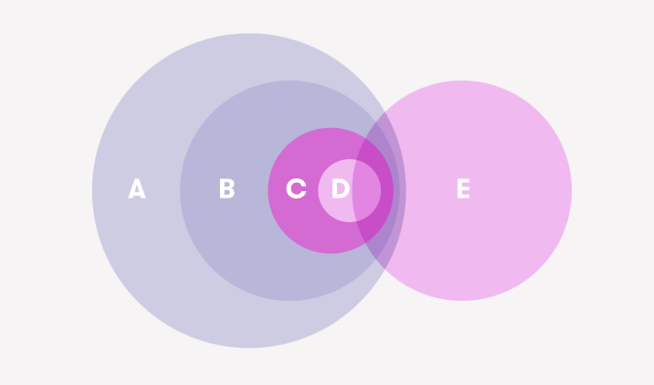

## Úvod
- Složité definovat, co je a co není AI
	- Charakteristika - autonomní (řídí se samo), adaptabilní (učí se z chyb)
- Nelze srovnávat IQ, jen jak dobře řeší určitý problém
- Umělá inteligence = vědní obor (proto nelze skloňovat, ani množné číslo, raději metoda UI)
- Robot - skládá se ze senzorů a aktérů (i neautonomní auta jsou roboty)

## Začlenění

*A. Informatika
B. AI
C. Strojové učení - systémy, které zlepšují svůj výkon v dané úloze na základě narůstajících zkušeností nebo objemu dat
D. Deep learning
E. Data science*

## Typy
- Turingův test
	- Čínský pokoj - protiargument
- Úzká x obecná AI
	- Úzká řeší 1 úkol
	- Obecná všechny, nereálné
- Silná x slabá
	- Silná - inteligentní (čínský pokoj), vědoma sama sebe, mysl
	- Slabá - vykazuje inteligentní chování (čínský pokoj)

## Links
[Elements of AI 1](Elements%20of%20AI)