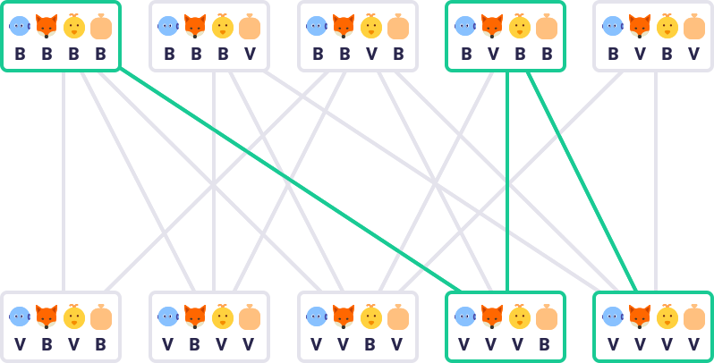
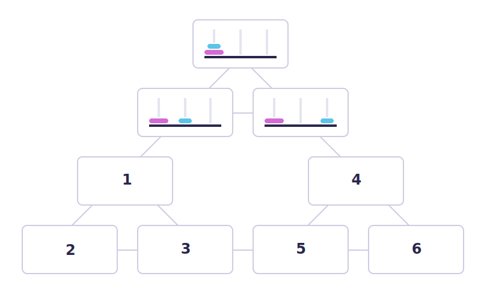

## Úvod
- Jak se dostat z místa A do B
- Proces:
	1. Napsat všechny možné stavy (**stavový prostor**, state space)
	2. Výchozí a cílový stav
	3. Nakreslit možné **přechody**
	4. Zapsat **náklady** jednotlivých přechodů
	5. Najít nejvýhodnější **cestu**

## Stavové diagramy

- Vše, co lze vypočítat, lze zautomatizovat
	- Turingův stroj (nekonečná páska), předchůdce počítačů
	- Turing complete

> [!quote] 
> „Snahou je pracovat na základě hypotézy, že každý aspekt učení nebo jakékoli jiné charakteristiky inteligence lze v zásadě popsat tak přesně, že je možné zkonstruovat stroj, který je dokáže simulovat.“
> - John McCarthy

- Každý prvek inteligence lze rozdělit do malých kroků tak, že každý tento krok je sám o sobě tak jednoduchý a „mechanický“, že jej lze zapsat jako počítačový program.

## Hry s úplnou informací
**Strom hry** (game tree), **kořenový uzel** (výchozí stav)

- **Minmax** - algoritmus pro minimalizaci a maximalizaci hodnoty stavu
- Předpoklad, že hráč vždy vybere nejlepší možnost
- Zvládání velkých stromů
	- **Alfa beta pruning** - vyřazení větví, ve kterých nemá smysl dopočítávat hodnotu, protože vedlejší větev je lepší
	- **Heuristická vyhodnocovací funkce** - vypočítáme pravděpodobnost výhry pomocí aktuálních pozic pomocí vah (třeba v šachu, kde se nachází figurky, střed je lepší, jaké typy figurek...)
- Nejistota a pravděpodobnost

## Links
[Elements of AI 2](Elements%20of%20AI)