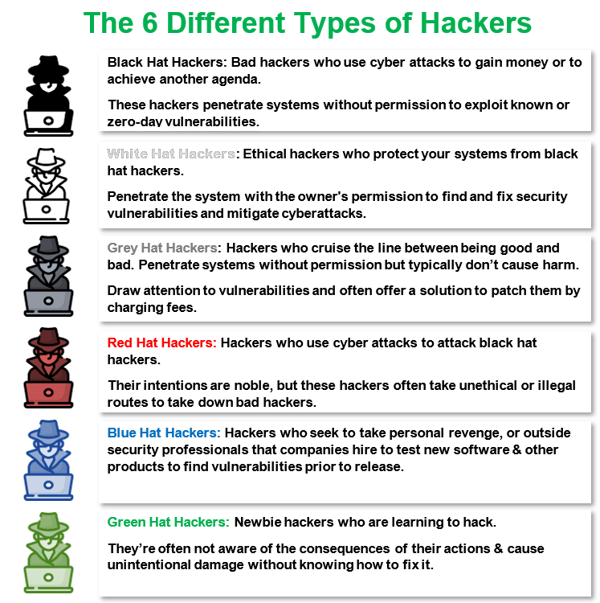

- Hacking 
	- It was used to describe the act of creating an innovative solution to a technological problem

## Hackers
- White hat hackers - ethical hackers
- Black hat hackers - for gains (money, power...)
- Grey hat hackers - for trolling and reputation

