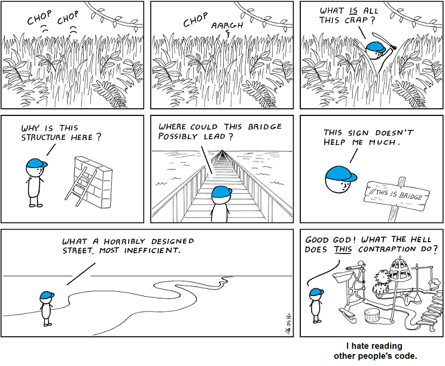

- Čitelný
- Rozšiřitelný
- Udržovatelný
- Efektivní

## Codestyle
- JS - CamelCase
- Python - PEP8
- Autoformatters

## Dekompozice
- Dekompozice úkolu na dílčí části
- Pokud kód obsahuje podcelek, který lze dobře pojmenovat, bývá vhodné vyčlenit ho do samostatné funkce
- Max. 4 úrovně deep nested

## DRY
- Do not repeat yourself

## Naming
- Funkce - sloveso
- Proměnné - podstatné jméno
	- V případě seznamu množné
- Podmíněné
	- isCool, hasChildren...
- Skokové funkce (break, continue, goto) - vyhnout se jim

## Typování
- [mypy - Optional Static Typing for Python](http://mypy-lang.org/)
- TypeScript
- Implicitní, dynamický, silný typový systém

## Asserty
- =Custom chybové hlášky
- Dobré pro ladění programu
- Používat asserty k označení vstupních podmínek

## Komentáře
- Psát samodokumentující kód
- Slouží k přidání dalším informacím v kódu, ne informací z kódu známých

## Global variables
- Zlo
- Třeba zkoumat všechny části, které můžou hodnotu globální proměnné ovlivnit
- Globální konstanty ano