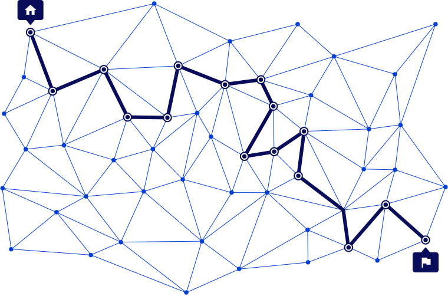
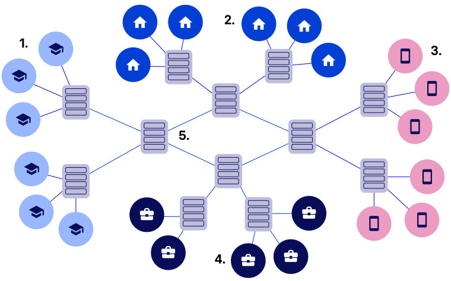
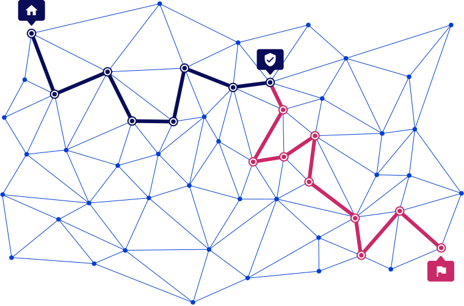

- Veřejné wifi - neposílat přihlašovací údaje, když už tak HTTPS
- HTTPS (zejména, kde odesíláme data)
	- False HTTPS
- Ideálně použít mobilní data
	- Riziko sledování operátorem
	- Stále HTTPS
- Silné heslo od hotspotu (pokud prolomí může sledovat moji aktivitu)
- IP6
- WPA2
- Změnit default heslo WIFI

## TOR
## Proxy

## DNS
- Servery
	- CZ.NIC
	- Cloudflare
	- QUAD9

## Networks
- Individual nodes - transmits data, usually has IP
- Internet - network of networks
	-  Any node, which it passes can monitor you (so encrypt)

### Local network
- Usually unencrypted -> anyone can spy through radio waves
- Default modem password is usually known
- Default admin password is known
- WEP and WPA are broken
	- Use WPA2/3

### Global network
- Use firewall (SW and HW)
	- Modems are HW firewalls
- Public WIFI should be also encrypted (... or anyone can see the shared content)

### Zero trust
- Network segmentation
- Monitoring of the devices and connections

### OSI (Open Systems Interconnection model)
- Layers of responsibility
- [Securing web connections](https://courses.minnalearn.com/en/courses/cybersecurity/networks-and-hardware/securing-web-connections/)

![[../../Assets/IT/Privacy, security/Images/Network_layers.svg]]

### TLS protocol (ensures encryption), certificates
- Anyone can issue certificates
- Man-in-the-middle attack (MITM)

### VPN
- =šifrovaný tunel
	- Encrypt from PC to exit node, then travells normally
- 2 funkce
	- Can hide origin, makes it look like it's from exit node
	- Connect separate networks together (connect to office network)
- VPN running on your mobile phone to connect to laptop is not secured by the VPN.
	- The phone acts as a router and will not use the VPN tunnel for tethered connections even though all the applications in the mobile phone do use the VPN
	- In a case like this it is best to enable the VPN on the laptop instead.
- S VPN můžu na veřejnou WIFI
- Koncový server, ale vidí aktivitu co děláme

