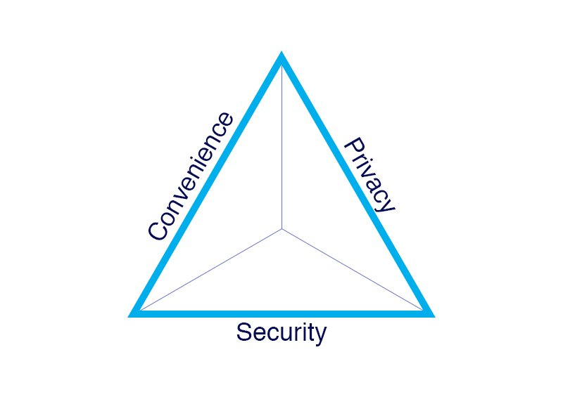
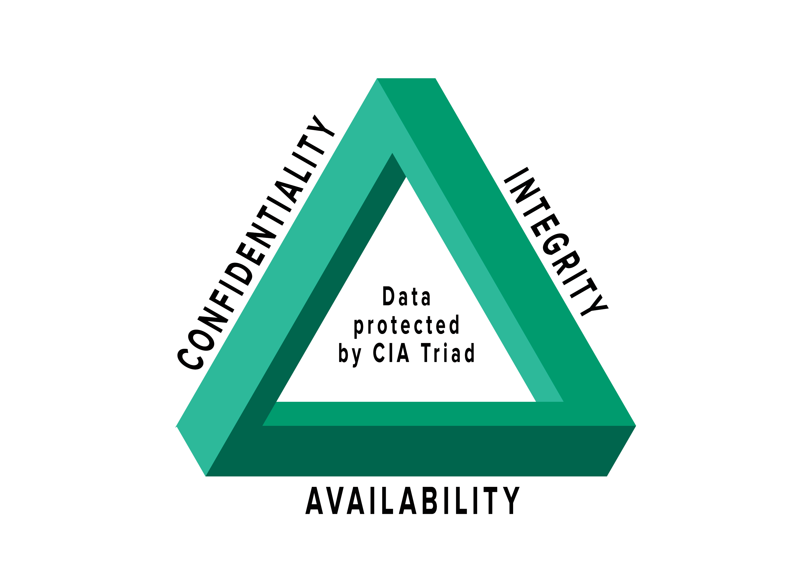
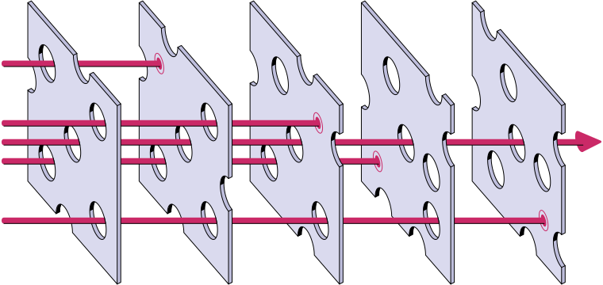

*Convenience vs security vs privacy*

## OpSec
[Opsec101](https://opsec101.org)

1. **Identify** the information you need to protect  
2. **Analyze** the threats  
3. **Analyze** your vulnerabilities  
4. **Assess** the risk  
5. **Apply** countermeasures

## CIA triad

 - **Confidentiality** – protected from unauthorized access
	- Encryption
- **Integrity** – protected from unauthorized changes, (completeness/accuracy is assured)
- **Availability** – authorized users have access to the data
	- Backups

## Evaluating risk
- 2 models
	- Risk = assets + threat + vulnerability
	- Risk = vulnerability * threat * impact
- Asset - type of data
- Threat
	- Threat modelling
		- STRIDE
			- Spoofing – impersonating something or someone else
			- Tampering – modifying data or code
			- Repudiation – claiming to have not performed an action
			- Information disclosure – exposing information to someone not authorized to see it
			- Denial of service – deny or degrade service to users
			- Elevation of privilege – gain capabilities without proper authorization
- Vulnerability
	- Types of vulnerabilities
		- HW
			- Susceptibility to humidity or dust
			- Susceptibility to unprotected storage
			- Age-based wear that causes failure
			- Overheating
		- SW
			- Insufficient testing
			- Insecure coding
			- Lack of [audit trail](https://en.wikipedia.org/wiki/Audit_trail)
			- Design flaw
		- Network
			- Unprotected [communication lines](https://en.wikipedia.org/w/index.php?title=Communication_line&action=edit&redlink=1) (lack of [cryptography](https://en.wikipedia.org/wiki/Cryptography), bad cryptography)
			- Insecure [network architecture](https://en.wikipedia.org/wiki/Network_architecture)
		- Personnel
			- Inadequate [recruiting process](https://en.wikipedia.org/w/index.php?title=Recruiting_process&action=edit&redlink=1)
			- Inadequate [security awareness](https://en.wikipedia.org/wiki/Security_awareness)
			- Insider threat
		- Physical site
			- Area subject to natural disasters (like floods or earthquakes)
			- Interruption of power source
		- Organizational
			- Lack of regular audits
			- Lack of continuity plans
			- Lack of security

## Defence in depth
- =multiple layers of protection

## Cybersecurity actionplan
1. Identify the asset you want to protect
2. Identify the risk based on losing access/getting hacked/having it stolen
3. What makes the asset vulnerable
	1. Weak points hackers can use?
	2. What might prevent me from being able to gain access to thes asset?
4. Countermeasures, use [[../../Assets/IT/Privacy, security/Images/CIA_triad.png]]
	1. Confidentiality
		1. What do you need to keep private/confidential?
		2. How can you boost the security of your confidentiality measures (stronger passwords, message encryption, network encryption, etc.).
		3. What tools or techniques can you use to boost the security of your private information?
	2. Integrity
		1. What kind of measures can you take to verify if this asset is secure?
		2. What cybersecurity tools can you check for or install/deploy to help make sure that your sent data is protected from unauthorized access and your received data is uncorrupted and from a trusted source?
	3. Accessibility:
		1. How can you ensure that you can prevent losing access to this asset or the data it contains?
		2. What tools can you use to help manage this accessibility?

## Random words
- Social engineering  - [Social engineering (security) - Wikipedia](https://en.wikipedia.org/wiki/Social_engineering_(security))
- OpSec
- Backdoors
	- Supply chain backdoors

## Types of attacks
- Enumeration attacks and user names
	- Forgot password - site leaks if username/email exists
	- Create account - user already exists
- Phising
	- Spear phishing - already has some info
	- Charakteristika
		- Too good to be true
		- Urgency
		- Links
		- Attachments
		- Sender is sus
- Malware (**mal**icious soft**ware**)
	- Virus
	- Ransomware
	- Worms
	- Botnet
	- Trojan horse
	- Adware
	- Spyware
- APT (Advanced Persistent Threat) - state backed

## Cryptography
- MAC - message authorisation code
- Kerckhoffs's principle
	- The secrecy of your message should always depend on the secrecy of the key, and not on the secrecy of the encryption system
- Use ciphers that are standards

## E2EE
- To decrypt you need to break into one of the devices

## Learn
[Cybersecurity](https://courses.minnalearn.com/en/courses/cybersecurity)
[Dávej kyber!](https://osveta.nukib.cz/course/view.php?id=67)
[Opsec101](https://opsec101.org)
[Stay Anonymous](https://www.youtube-nocookie.com/embed/a1i-3xwcSGA)