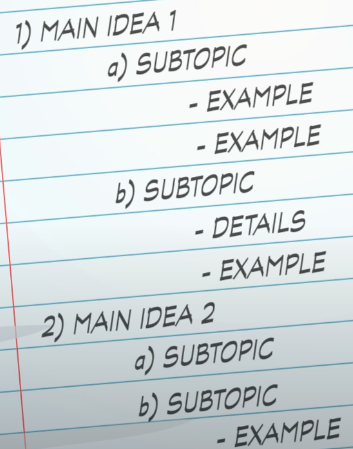
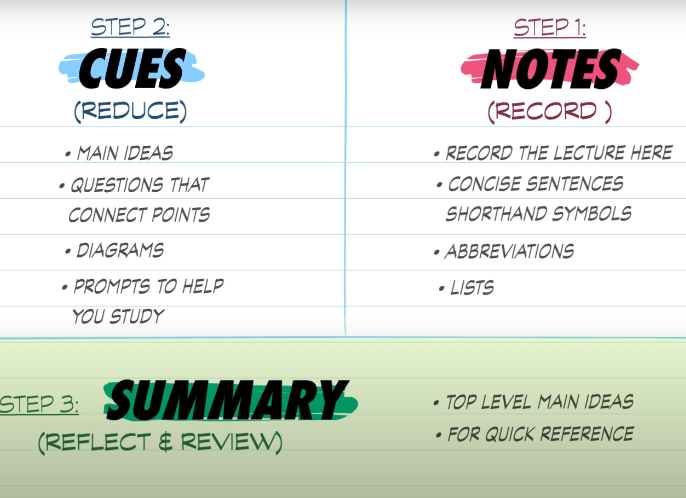
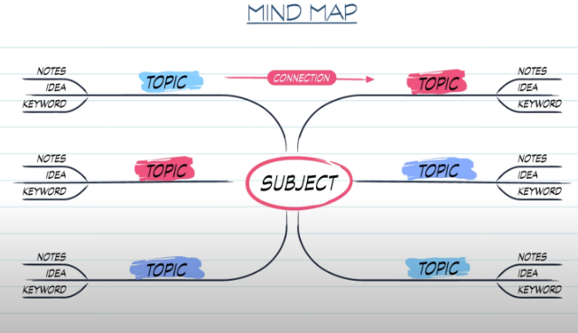
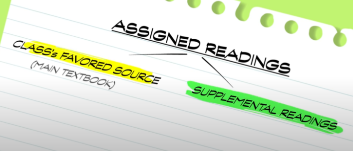

<a class="rich-link-card" href="https://thecrashcourse.com/topic/studyskills" target="_blank">
	

		

	

	

	

		<h1 class="rich-link-card-title">Study Skills  - Crash Course</h1>
		

		https://thecrashcourse.com/topic/studyskills
		

	

</a>

## Taking notes
- Psaní na papír je pomalší než laptop, tudíž píšeme jen to důležité a ne word to word
- Put in your own words
- Look at syllabus
- Zapsat si velké myšlenky (summaries, overviews, conslusions...), terms and definitions, bullet lists, examples

### Outline method

### Cornell method
- Summary - 1/2 big ideas

## Mindmap

## Reading
- I don’t have to read everything (opportunity cost)
- What to read?
	- Main - should read
	- Supplemental - can skip
- Importancy: arguments>description>context
- Skim main ideas
- Pseudo skimming
	- Read first and last sentence of paragraph
	- Bolding, italics, other formating...

## Learn
[How to Become a Straight-A Student by Cal Newport](https://www.goodreads.com/book/show/253203.How_to_Become_a_Straight_A_Student)