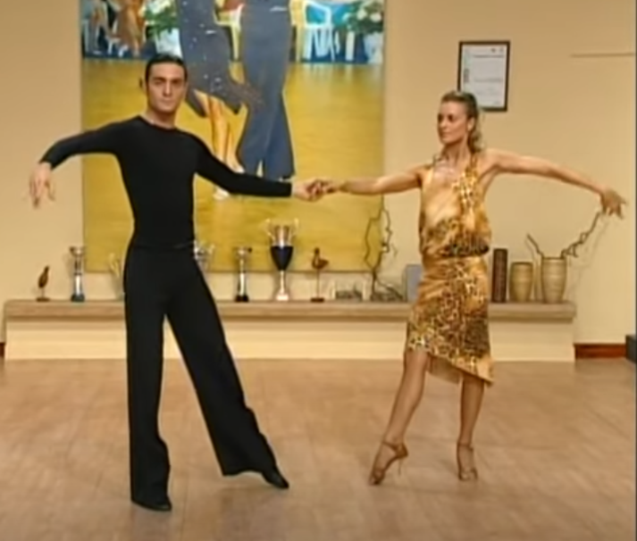

## Standard
---
### 🕺Waltz
- Tancovat na své straně
- Žárovka
- Koleno na špičce s trupem jedna linie
- Dotek na obou nohách - to musí znát partnerka
- Ruce v přímce, lokty v rovině
- Ruka a uchopení kolmo k zemi

**==Vazba 1==**
- [Watch](https://www.facebook.com/100010862351557/videos/1342942009411198/?idorvanity=286227529026294)
- U promenády otočit o 1/8
- U zášvihu zůstat nahoře a až na 1. stlačit dolů

==Medailové==
- Otáčka vpravo, vlevo
- Základní krok
- Výměna mimo? (B)
- Zášvih, promenáda, raz dva a tri (S)
- Chůze pozadu a vedle sebe (Z)   

---
### 🕺Quickstep
- Tancovat na své straně
- Žárovka
- Ruka na lopatce, partnerka teploměr
- Nehopsat, ale šlapat kroky

**==Vazba 1==**
- [Watch](https://www.facebook.com/100010862351557/videos/1347716185600447/?idorvanity=286227529026294)

==Medailové==
- Základní krok aka pilka (SSQQ)
- Otočka vpravo normální (Základní krok, pak SSQQ SSQQ)
- Slézt ze stříšky základním krokem a nato_ se do směru tance
- Otočka vlevo (B, SQQ SQQ)

- Otáčka vpravo víc - vylést na stříšku ZK, točit tak moc aby nemohla udělat krok a zvednout se a měla nohu zvedlou (S, SS SS QQ na srovnání do směru)
- Chasé chůze - krok, krok do partnerky, křížení

- Polka ma místě, naklonění trupu

==Opakování zlato==
- krok, krok, křížení, krok
- Krok polka na naklonění vlevo, otáčení doprava,
- Polka naklonění vpravo,

- Méně nahýbání je více

- Otáčka vpravo SQQ
- Křížení dozadu, před sebou SQQS, leva první
- Pádlovani QQS
- Křížení s vybočením dozadu SQQS skončím levou dozadu a natočen o 1/8

- Asi krok krok

---
### 🕺Tango
- Základní krok
- Promenáda
- Otevření šikmo (B)
- Uzavření rovně
- Otáčka vlevo (SQQ SQQ)
- Vkročení a houpání [krok, vkroč, houpu se, už to je]
- Otevření rovně, krok, vkročit, točit. Točím se. Houpání- už to je. (S)
- Chod dozadu QQQQ a otočit hlavu
	- Krok, vkroč, zakřiž, vykřiž S/QQ (Z, SQQS)

---
### 🕺Valčík

---
## Latina
### 💃 Cha-cha
- Nohy od sebe a napnuté
- Chodit přes špičku
- Přípravný krok, 2.+3. doba houpání, 4. doba chacha chůze

**==Vazba 1==**
- Chození vpřed a zad 3x
	- Zarážky - nedávám váhu úplně dopředu, ale do středu
- Alemana
	- CW, tlačím levou
- Tři cha chachy
- Kubánské přerušení
- New York
- Sólo otáčka
- 2 timestep na místě
- Ruka k ruce
- Tři cha chachy
- New York
- Podotáčka
	- Směrem CCW
	- Palec dolů
- Sólo otáčka s natočením zpět do začínajícího postavení
	- Oba se otočíme speciální newyorkskou otočkou
	- Partnerka se trochu u toho natočí šikmo, já ji pak na poslední dobu natočím k sobě)
	- 1. krok - točím
	- 2. krok - přisouvám P k sobě
	- 3. krok - dotočím se šikmo na místě

**==Vazba 2==**
- Chození vpřed a zad 3x
	- chacha raz
	- Dva - zarážka, nepřenáším celou váhu, jen do středu
	- Tři - váha P
- Vějíř s hip twistem
	- Cha - L vzad zarážkovitě
	- Cha - P váha, L přisunu
	- Raz - přisunu L
	- Dva - P vzadu krok zarážkovitě
	- Tři - krok stranou nebo na místě (ZEPTAT SE)
	- Cha - Hip Twist, P vsunu před levou
	- Cha - váha L
	- Další Raz do strany a jsme v otevřeném V
	- Hip Twist - [CHA CHA CHA - Open Hip Twist to Fan, Alemana, 3 Cha, Cuban Breaks, Closed Hip Twist to Fan - YouTube](https://youtu.be/ydoIrfZoFlg?t=49)
- Hokejka
- Alemana
Chacha  
...bezne (zarazkovite)  
Vějíř  
Hokejka  
Zarazkovite  
Káča (zakrizim, posunu, cha predkrizim, dva -  
Opening out - RF krok, pak LF vepredu opening out, RF - vaha, LF - hip twist neboli zakrizim, RH - vaha, LF - otvírá)  
  
  

==Medailové==
- Základní krok - korta
- New York
- Ruka k ruce
- Vějíř (B)
- Alemana (B)
- Hokejka (S)
- Káča (S)

- Miláček s vrácením
- Miláček s chozením
- Zahodím (větrník)
- Hokejka
- Káča 1.5
- 2x cha-cha, 1x New York (Z)
- Otáčka oba a uchopení do jiného držení 
- Cuban breaks (Z)

---
### 💃 Rumba  
- Osmička v bocích
- Nohy od sebe a napnuté
- Vynechávání 1. doby, začínat přípravným krokem na 4.
- Rumba chůze, rotování boků, chodit s váhou přes střed a na špičku

**==Vazba 1==**
- Chození vpřed a zad 3x
	- Zarážky - nedávám váhu úplně dopředu, ale do středu
- Alemana
- New York
- Sólo otáčka
- Timestep/na místě 2x
- Ruka k ruce
- New York
- Podotáčka
	- Směrem CCW
- Sólo otáčka s natočením zpět do začínajícího postavení

**==Vazba 2==**
- Chození vpřed a zad 3x
	- Zarážka
- Vějíř
	- 1. část
		- Čtyři - P vpřed
		- Dva - L vpřed
		- Tři - přísun, pokrčený kolena, změna váhy
		- Čtyři - dokončit přísun, změna váhy na neutrálně (nejsem náhodou váhově neutrálně tady ZEPTAT SE, asi jo)
	- 2. část
		- Dva - R vzad zarážkovitě i s váhou, tím otočím partnerku
		- Tři - změna váhy, spojit kolena
		- Čtyři - bokem, šikmo otevřít
	- Skončíme takto: 
- Základní krok 1x
	- Nebo kučarača (ZEPTAT SE)
- Special krok
	- 1. krok - P šikmo dozadu, natočení doprava
	- 2. krok - přenesení váhy
	- 3. krok - natočení do 135 °, P vpřed
	- A u toho ji točím? (ZEPTAT SE)
- Laso
	- Chytám za rameno
	- Zatočím MLH s její HRH, abych ji měl za hlavou
	- Ruka skončí za jejími zády
	- Já u toho kučarača
- Asi alemana
	- Já zase special krok a kučaraču
- Miláčci 3x (nebo 2x, protože první je opening out? ZEPTAT SE)
	- Ruka jde s nohami ven a pak zpět
	- Chytám za lopatku/rameno
- Spirála
	- Pro mě kučarača - nohy od sebe, přenáším váhu
	- Na tři se natočit nohami už dozadu (ZEPTAT SE zda na 3. nebo 1. další) 
- Chůze vzad
	- 3 kroky
	- Nezapomínat osmička
- Houpání
	- Pro pány se stresem - neboli nadzvednuta L pata na přední noze a dam do ni váhu
- Sólo otáčka (oba)
	- 1. krok P směr protisměru, směrem doleva
	- 2. krok L ve směru
	- 3. krok P dotočím
- Otáčka partnerky style spirály/palec dolů, neboli opak alemany
	- Někde jsem měl uvedeno že hokejkou k sobě asi to je špatně
- Od začátku

==Medailové==
- Základ
- New York
- Ruka k ruce
- Vějíř (Bronz)
- Esíčko (S)
- Miláčci (S)
- Chození vedle sebe do kosočtverce (Z)
- Náznak
- Káča
- Hand to hand
- Špageta
- Houpání
- Otočka

==Opakování zlato==
- Do toho we dostaneme po otočce, která následuje po 3 miláčcích

- Držení jen pravou rukou, základní krok
- Kadeřník - otočka (přehodím pravou ruku do levé, dáma ruku na nima), dostaneme se do vějíře.
- Základní krok 1x
- Alemana do držení se vedle sebe (do kosočtverce)
- Chození do kosočtverce 3x. (Vnější nohou)
- Po 3. chytnu levou rukou pravou a udělám vějíř.
- Váhání/houpání/chození dopředu.

- Káča.
- Opening out - Vedle sebe já dopředu, ona vzad
- Otáčka, levou rukou doprava
- Ruka k ruce 1x
- Aida (já jakoby se otočím a jdu dozadu, ona se zamitá a skončí zamotaná a jdeme dozadu)
- Váhání/houpání 1x
- Z 4.D na 1.D se otočíme k sobě
- Otáčka oba

---
### 💃 Samba
- Ruce pořád nahoře nebo přirozeně dole
- Bounce
- Vršek se nehýbe

**==Vazba 1==**
- Na místě 2x
	- Přípravný přítah L
	- R první
- Zášvihy 2x
- Podotáčka na 2 takty
- Samba walk 1x
- Otevření k sobě 1x
- Samba walk 1x
- Otevření k sobě 1x
- Bota fogo 2x
- Volta k sobě 4x
	- Poslední je zakončující směr ven
- Volta k sobě na druhé straně 4x

- Přísun levé a začátek...

Otacka vlevo 1x,, RH padá dolů, LH pouští  
Stromecek  
Na 4. takt zmenim kroky (jen presunu pravou vpravo, prisunu LF) u toho navedou LH partnerku aby se otocila nabizim ruku a chytam do ramu  
Otáčka vlevo  
Zacatek

==Medailové==
- Přes potok
- Zášvihy
- Podotáčka
- Samba walk 3x
- Volta
- Bota fogo
- Májka 6+2 doby
- Zášvih

- Z 2x bota fogo do kruhu, tlačím do ruky, při tom volta
- Bota fogo sideways
- ...
- 1 bota fogo
- Zakopnu
- Volta

- 3x zášvih
- Přenáším váhu
- Bota fogo

==Opakování zlato==
- Začátek z postavení bota fogo
- Bota fogo 2x
- 4x volta, partnerka stále přede mnou
- Bota fogo 2x
- Kruh
	- Volta s tlačením do ruky, aby vznikl kruh, 4x
	- Bota fogo do strany 2x
	- Volta točení v kruhu 4x
	- Bota fogo 1x
- Bodnutí/kopnutí LF na místě, partnerku otočím doprava
- Volta stranou 4x (natočení na sebe)
- Stromeček 4x
	- *Od sebe a k sobě*
	- Na konci vždy nohu natočím
- ...něco asi majka na 4 (tzn. volta a točení partnerky)
- Zášvih 3x
- Točení partnerky 1x a přemístění na levou stranu do původního postavení

  
---

### 💃 Jive
- Má dělat specifický pohyb, kdy na druhou jdeme dolů 

**==Vazba 1==**
- Základní krok
- Brána
- Americká spina
- Bič
- Progressive movement
	- 2 varianty, buď se natáčím s partnerkou nebo chůze po straně
- Smyčka
- Dvojitý bič

==Medailové==
- Brána, smyčka
- Výměny
- Bič (B)
- Americká spina (B)  
- Progressive movement (S)  
- Zakopávání (S)
- Nasazování mikiny (Z)  
- Přechod za zády, tunel (Z)  
- Americká spina  
- Výkruty

---
### 💃 Salsa
- Základ
- Samostatné otáčky
- Přechod (Bronz)
- Sombrero

---
## Polka

**==Vazba 1==**
- Vedle sebe hopsání 2 celé cykly
- Hopsání po směru tance
	1. Vedle sebe
	2. Otevření dopředu
	3. Vedle sebe
	4. Otevření dozadu
	5. Sólo otáčka
	6. Poskok na zastavení
- Podcházení pod rukou 2x
- Točení (jak ve waltzu) 4x
- Rejsování 4x
	- Začínám MLH do HRH, noha jde podle ruky steně
- Na místě poskakování a skok

==Medailové==
- Otevírání/zavírání
- Točení
- Rejsování (B)
- Otevírání a zavírání vedle sebe (B)

## Zkratky
- P = pravá
- L = levá
- MLH - my left hand
- CW - clockwise, vždy z partnerova pohledu
- CCW - counter-clockwise, vždy z partnerova pohledu
- Úhly v latině vychází klasicky, jak v matice, 0 ° je pravá ruka, 90 ° levá