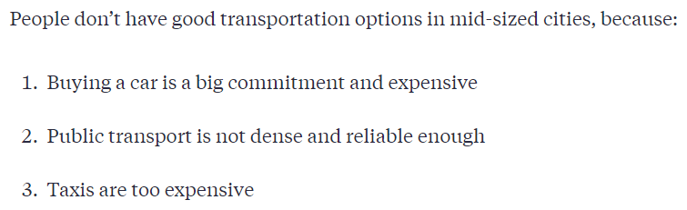

## Hledání problému, který potřebuje být vyřešen

- Build products people want, not that is enthusiastic to founders
- Rozejít se se solution a zapomenout na to
- Komunikovat se zákazníky (ti co řeší problém) a vyvíjet

> [!note] Nejdůležitější otázka startupů
> Jaký problém řeším?

- Musí ho řešit více lidí (dostatečně velký trh)
- Lidé musí být ochotni zaplatit za řešení (customer cost < customer gain)
- Speciální výjimka
	- Vytvoření hype okolo cool věci
	- Lidé ho ale později přestanou využívat, protože jim nic neřeší

- Jaký problém trápí mě?
- Některé problémy jsou, tak zaryté že je už vnímáme jako normál
- UN SDG

3 filtrovací otázky:
1. Je to důležitý problém?
	- Build a business around a problem you think is important
	- Jaké je naše proč a motivace?
	- Dělat věci co nás baví
2. Is this something you like doing on a daily basis?
	- Je to něco, co by mě bavilo řešit?
3. Do you have an understanding of the problem?
	- Nemusíme být experti, ale víme jaké je to mít ten problém

- Value Based Entrepreneurship

## Validace problému
- Před řešením problému je lepší ho zvalidovat, abychom po letech nezjistili že to řešení nikdo nepotřebuje
- Nevidí ten problém ostatní jinak?
- Bolí dostatečně ten problém? Budou ochotni platit za řešení?
- Definovat hypotézy a ověřit je

- Customer interviews are hard
	- [The Mom Test](../Knihy.md##The_Mom_Test)
- Principy
	1. Nemluv o nápadu
		- Zaměř se na jeho život a problémy
		- Popřípadě mluvit o nápadu až na konci
	2. Co nejspecifičtější otázky
		- Ale nenavádět k odpovědím
		- Radši jak reagoval v minulosti, ne jak by reagoval
	3. Nemluv, poslouchej
		- Cíl je získat co nejvíce kvalitních dat o jeho životě
		- Otevřené otázky
	4. Vždy si nastav cíle a hypotézy, které chci zjistit
		- A nahrávat/dělat si poznámky
- Minimálně 10 rozhovorů (ideálně 20-30) pro potvrzení hypotéz
- Systematický nahrávat výsledky a na konci analyzovat
	- Existuje ten problém?
	- Bylo by naše řešení hodnotné pro cílovku?
	- Pokud ho mají jen někteří, tak co je spojuje?
- Na základě výsledku další hypotézy nebo prototyp a testování

## Hledání cílovky
- Všichni = nikdo
- Co nejspecifičtější
- Začít na niche skupině
- Koho nejvíc pálí můj problém?
- Je ale dobré provést rozhovory i s jinými lidmi pro porovnání

### Jak důležitý je problém?

> [!NOTE] Velikost trhu
> % - procento lidí co řeklo při rozhovoreh, že je to trápí
> % * all the potential users = počáteční trh

- Bude je trápit i problém v budoucnu nebo vyšumí?

## Poslání
- Důležité pro:
	- Pro investory
	- Pro zaměstnance a talenty
	- Pro early birds
	- Focusing on what matters
- Způsoby tvorby
	- Nejjednodušší varianta - jaký problém řeším?

## Falling in love...

> [!quote] 
> Don’t fall in love with your product – fall in love with the problem you are solving

## Zdroje
- [Finding a problem that needs to be solved | Starting Up](https://courses.minnalearn.com/en/courses/startingup/the-problem/finding-a-problem-that-needs-to-be-solved/)
- [Validating the problem | Starting Up](https://courses.minnalearn.com/en/courses/startingup/the-problem/validating-the-problem/)
- [Finding your target group | Starting Up](https://courses.minnalearn.com/en/courses/startingup/the-problem/finding-your-target-group/)