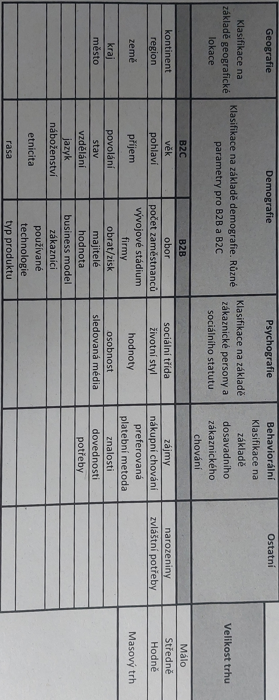

> [!quote] Zákazník
> Zákazník je člověk, který chce můj produkt. Má možnost a pravomoc si ho koupit. Má stejné hodnoty. Chápe význam prduktu.  Používámním produtktu získává výhody.

> [!quote] Uživatel
> Ten kdo daný produkt užívá.

## Cílovka
- Já != zákazník (kognitivní zkreslení)
- Co nejpřesnější
- Kolik jich je?
- Uživatel x zákazník
- Nákupní chování
- Co se jim líbí, obavy, goals x frustrations
- Customer centered design
- Hodnota
	- Musí být kvantifikovatelná
	- Dělám to co někdo chce?
	- ==Customer cost < customer benefit
- Kritéria
	1. Rozpoznatelná
	2. Odlišitelná - od ostatních
	3. Homogenní - společné znaky
	4. Oslovitelná - koho mohu oslovit
	5. Dostatečně velká
		- [Velikost trhu | JIC](https://www.jic.cz/magazin/dobrodruzna-vyprava-smer-trh/)
- [Atlas Čechů • Poznejte Čechy do detailu](https://atlascechu.cz/)

## Persona
### Otázky
- *Jaké jsou jeho problémy a potřeby?*
- *Jaké má vlastnosti?* _př. je komunikativní, extrovert/introvert, rád objevuje a zkouší nové věci/má rád jasné postupy a zajeté koleje…)
- *Věk a pohlaví?*
- *Jak tráví volný čas?*
- *Kam chodí do práce/do školy a jaký má příjem?* 
- *Co běžně kupuje?* 
- *Kdo je jeho vzor? Kým by se chtěl stát?*
- *Kde se s ideálním zákazníkem můžeme setkat?* (Jezdí MHD? Tráví čas v přírodě
nebo v obchodech?)
- *Jak probíhá je jeho/její typický den?* 
- *Jaké jsou jeho/její sny a ambice?*
- *Čeho se bojí a jaké jsou jeho/její noční můry?*

- Doporučený guideline:
	- Geografie
		- Fotka
		- Jméno
		- Citát
		- Věk
		- Pohlaví
		- Bydliště
		- Occupation
		- Job title
		- Vzdělání
		- Příjem
	- Sales objections
	- Cíle a motivace
	- Challenges a překážky
	- Zdroje informací
		- Knih, blogy, konference, experti, magazíny, weby, účty na sockách
### Tools pro tvorbu
- [Make My Persona - Free Persona Template Generator by HubSpot](https://www.hubspot.com/make-my-persona)
- [Free Buyer Persona Templates and Builder | Semrush Persona](https://www.semrush.com/persona/)
- [Personas Creation | Customer (User) Personas Online Tool – UXPressia](https://uxpressia.com/personas-online-tool)

## Learn
- [Jak definovat cílovou skupinu a personu | JIC](https://www.jic.cz/magazin/jicblog-jak-definovat-cilovou-skupinu-a-personu/)
- [Zákazník a trh – jak je poznat? | JIC](https://www.jic.cz/magazin/jicblog-zakaznik-a-trh-proc-je-musite-perfektne-znat/)
## Zdroje
- [Zákazník | JICskill](https://skill.jic.cz/lekce/lekce-3/)

