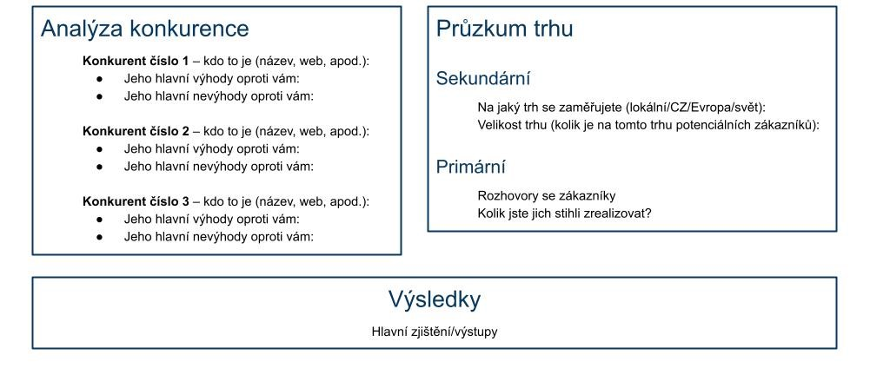

## Dělení
- Je dobré získat data, protože kognitivní zkreslení (sekundární)
- Behaviorální ekonomika (primární)
- Směřování pozornost
- Ověřování hypotéz
	- Dívat se na negace hypotéz, abychom potvrdili

- [Metody designu](Metody%20designu.md)

## Primární = lidi
- focus groups, dotazníky, rozhovory
- -cena
- Neptej se na názor, ale minulost, jejich život

## Sekundární = data
- +cena
- -není specifické na můj byznys
- Zákazník: Kolik jich je? Kde jsou? Velikost zákaznických segmentů. Je jich dost?
- Legislativa: Certifikace, regulace, IPR
- Zaměstnanci: Seženu na to lidi?
- [2 Konkurence](2%20Konkurence.md)

- Kombinace obou = sweet
- PESTEL analýza

## Next step
[3 Cílovky a persony zákazníků](3%20Cílovky%20a%20persony%20zákazníků.md)