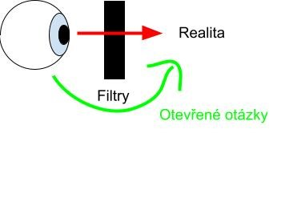
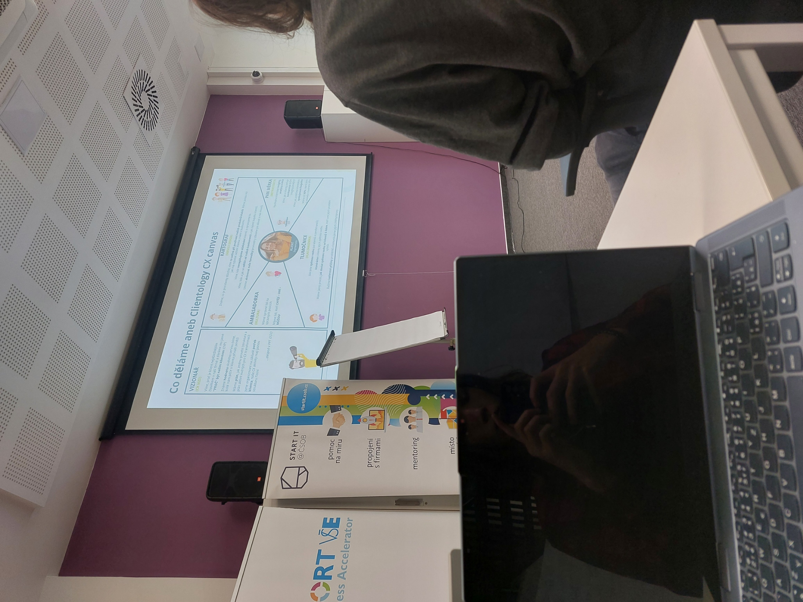
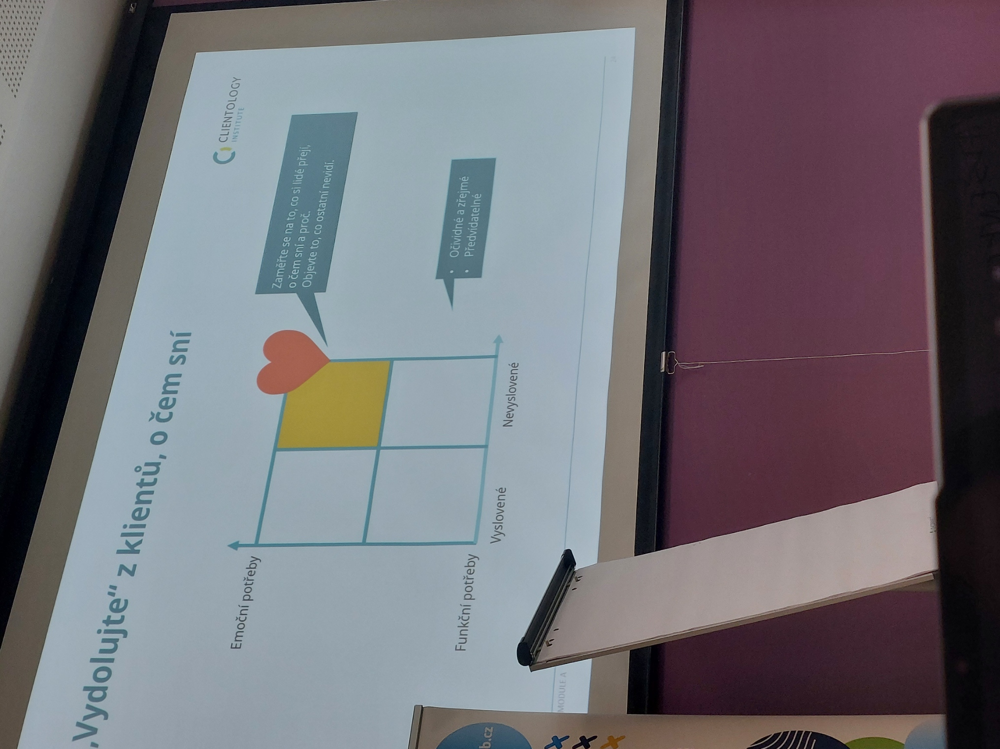
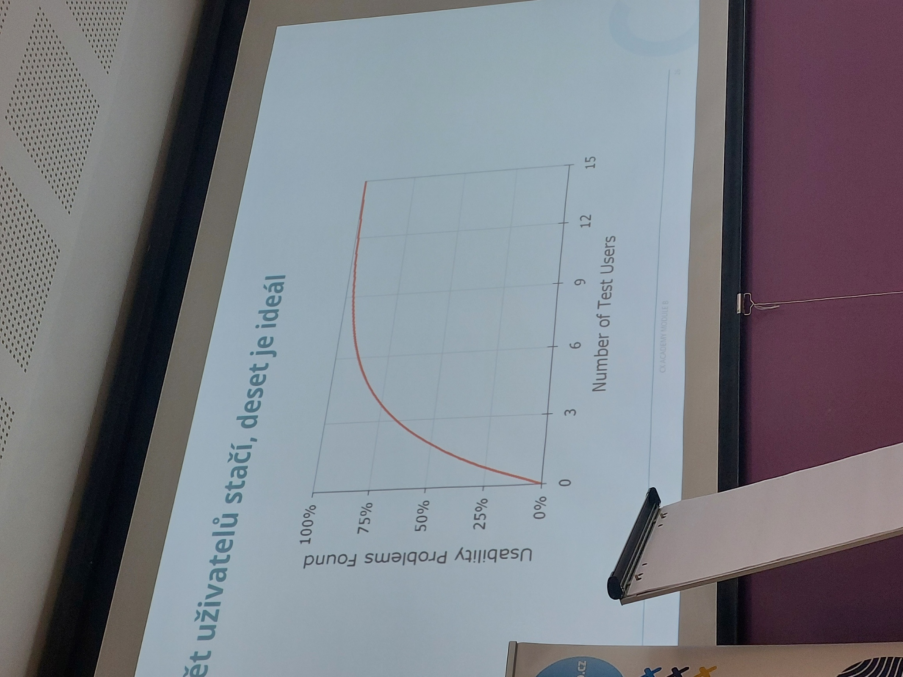
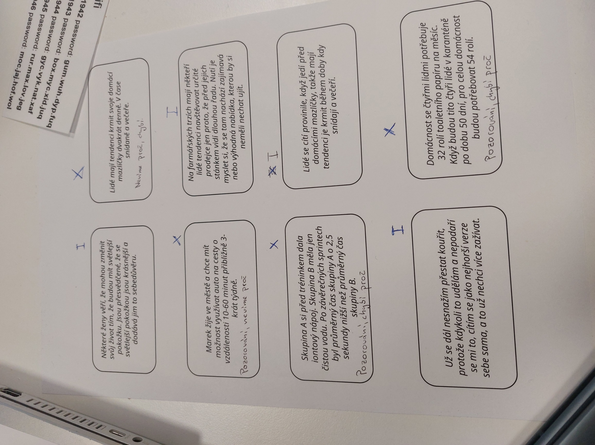
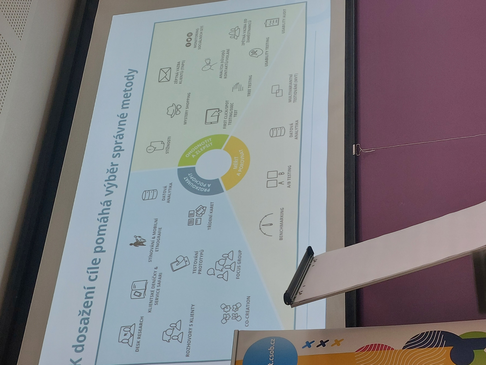
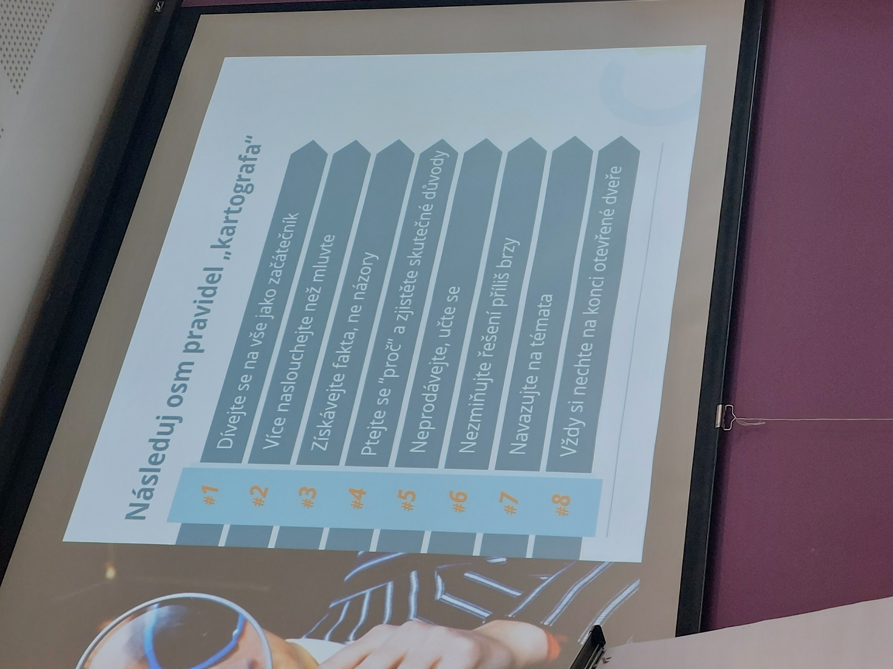
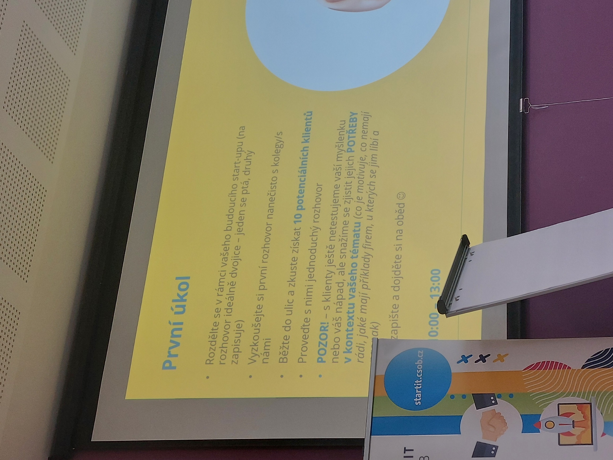

## Validace obecně

*Ptát se na otevřené otázky, abychom viděli skrz naše filtry.*

- **Moc se nezamilovat do svého nápadu, vidět fakta a zpětnou vazbu**
- Nechci si jen potvrdit svoji představu? Nebo zjistit zákazníkovy potřeby?
- Odprostit se od filtrů pomocí kvalitních a otevřených otázek s cílem něco zjistit

1. Rozvíjím myšlenky
2. Vedu přemýšlení
3.  Vedu rozhovor

- Ptát se na problém ne produkt
- Neptat se na názor na cenu
- How to do a survey, pak otestovat na malém vzorku
- [Metody designu - testování](Metody_designu.md##Testování)

## Validace nápadu
- [6 tipů, jak ověřit nápad | JIC](https://www.jic.cz/magazin/6-tipu-jak-overit-napad/)

## Insights
- Co jsou jeho potřeby?
	- Proč to potřebuje? (Jakou práci vykonává)
	- Jaký máte problém, který Vám mohu vyřešit? (Ale lidé neví, co chtějí. Odpoví nám co by chtěli, co už někde viděli.)
- Aktualizovat insights
- Value Proposition Canvas
	- Znát potřeby a vždy se ptát **proč?**
- 3W insightu
	- What? Co dělají
	- Why? Proč to dělají
	- Wow! Čeho si nevšimli lidé před námi
- Metoda 5 whys
	- [What's the root cause to problems? The 5 Whys will reveal all! | YouTube](https://www.youtube.com/watch?v=wdm-23pdS-I)

- Triangulace
	1. 
	Být zákazníkem

- V B2B 5 stačí
- Lidé (i šéfové) se rádi baví a jsou nápomocní, pokud jim dáte důvod (lepší budoucnost, ušetření nákladů, menší pain...)

1. Dívat se na to jako začátečník
	- Nepoužívat terminologii
3. + 4.
	- Vynechat naše řešení
	- Otevřené otázky
5. Neprodávat naše řešení, ale jak ho vnímá
	- A taky nevysvětlovat řešení, nechat ho na to přijít, ptát se proč tak učinil (učil jsem se na JIC při Design Thinking)

 8. Testovací skupinka se kterou komunikuji a buduji řešení

- Otázky/diskuzní skript
	- Definované otázky brát jako jen vodítko
	- Měli by ho znát všichni v týmu
	- Logicky uspořádaný do témat
	- Úvodní a závěrečná část
	- Co chceme zjistit, hypotézy
	- Neodbíhat k nerelevantním tématům

## "Grilovačka"
- 1 dotazovaný, 1 tazatel, 1 zapisovatel, kritické dotazy
- Otázky pro inspiraci:
	- Co víte, že je na řešení špatné?
	- V čem je vaše konkurence lepší?
	- V čem jste od konkurence odlišní?
	- Proč jste se v této oblasti řešení…. rozhodl právě takto….?
	- Do čeho vkládáte největší úsilí?
	- Jaké jsou 3 důvody, proč by vaše řešení nemělo uspět?
	- Cílová skupina:
		- Proč by vaši zákazníci měli zvolit raději konkurenci?
		- Proč jste se rozhodl pomoct s problémem / potřebou zrovna této cílové skupině?
	- Tým a motivace:
		- Jaká dovednost vám ve vašem týmu nejvíce schází?
		- Jsou lidé, kteří na tomto řešení pracují nejlepší se kterými můžete pracovat?
		- Proč byste pracoval / pracujete na tomto řešení místo něčeho jiného?

## Validace MVP
- Validovat ochotu zaplatit
- Testujeme vždy s cenou! (Ptát se na cenu, jaká je poptávka)

## Validace trhu
- [Junglescout](https://www.junglescout.com/) - look at sales volume for any search on Amazon
- [Import Genius](https://www.importgenius.com/) - look at import records for everything coming into the country; shipping big weight = selling big volumes
- [Facebook Ad Library](https://www.facebook.com/ads/library/?active_status=all&ad_type=political_and_issue_ads&country=US) - look up ads that are running on facebook or ig for any brand
- [KWFinder](https://kwfinder.com/) - look up how much search volume is happening
- [Google Trends](https://trends.google.com/trends/?geo=US) - look up macro trends around a specific topic
- Shopify Receipts - buy a product and look at the # on the receipt...all shopify stores start at 1,000, so you can see how many orders have been placed
- [Shopify Traffic](https://myip.ms/browse/sites/1/ipID/23.227.38.0/ipIDii/23.227.38.255/sort/2/asc/1/) - look up how much daily traffic a specific shopify store has

## Jak komunikovat se zákaníky
[How To Talk To Users | Startup School](https://youtu.be/z1iF1c8w5Lg)
## Learn
- The Mom Test
	- [Summary](https://jaspercurry.com/books/the-mom-test)
	- Book [The Mom Test](../Assets/Podnikani/validace/The_Mom_Test.pdf)

## Next step
[7.1 Prototyp](7.1_Prototyp.md)