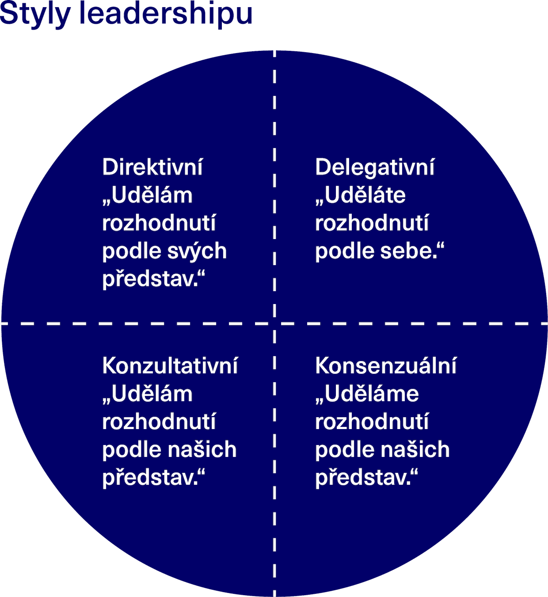
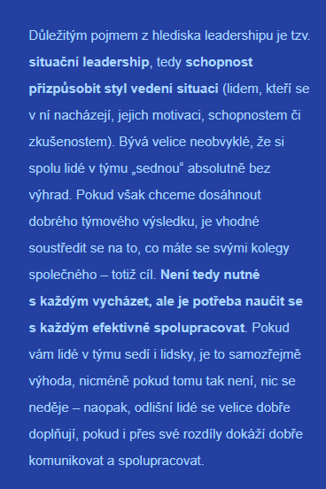

## Manažer x lídr
- Lídr je člověk, který dokáže druhé vést a motivovat k tomu, aby šli za hranice obvyklého a všedního
- Charakteristika
	- Mít vizi a v ní věřit
	- Nadšení a to předávat
- V nouzi se vždy ve skupině někdo stane leader

/Tm_vs_skupina.png)

## Historie
1. Charismatický bílý muž, vysoký, mužný, hluboký hlas
2. Inteligentní, společenský finanční analytik
3. Výsledky a vztahy s lidmi
4. Všímá si světu
5. Situational leadership
	- Přizpůsobitelný okolí
6. Manažer x leader (translational)
	- Manažer: translační, úkoly, lidi
	- Leader: dává vizi
7. Versatilní
	- Strategický (má cíl), operativa (úkoly, profackování), directive (úkolování), soft (vztahy)
	- Slabé stránky kompenzovat nástroji, lidmi
	- Slabé stránky podhodnocujeme, protože nám nejdou a nevnímáme je jako důležité
8. Sloužící (servant)
	- Opečovává firmu
	- Zahradník (leader), co zalévá opečovává rostlinku (lidi, firmu), slouží jim, ale je pánem
9. Rozptýlený (diffused, distributed)
	- Každý může být leader, i prodavačka
10. Transformational Leadership
11. Androidhuman leadership
	- Umí řídit lidi i roboty

## Typy leadershipu
- Leadership (styl vedení) = způsob jakým řídí skupinu

## Sloužící
10 vlastností
Hodně z toho jsou silné stránky [Sebereflexe - Talenty a silné stránky](../Seberozvoj/Sebereflexe_-_Talenty_a_silné_stránky.md)
Není důležité je mít všechny, ale umět kompenzovat ty slabé
1. Empatie
2. Naslouchání
3. Sebeuvědomění
4. Léčení (Harmony)
5. Koncepční a strategické myšlení (strategic)
6. Přesvědčivost
7. Správcovství
8. Předvídavost
9. Vytváření komunity
10. Závazek k růstu lidí i organizace

## Leadership judgement indicator
- Test a zároveň jedno z nejpopulárnějších členění leadershipu
- Každý preferujeme určitý styl (dimenze preference), ale pro každou situaci je lepší jiný (dimenze adekvátnosti)

x axis - rozhodování členů samostatně (ne/ano)

### Direktivní
- Manažer rozhoduje podle svých názorů, ale může přijímat od podřízených informace, které zesyntézuje a rozhodne
- **Rozhodování** - manažer (svůj názor)
- **Ideální v**
	- Časový press
	- Nízké kvalifikaci ostatních členů
	- Nově sestavené týmy (bez psychological safety [Efektivní tým (Google Aristoteles)](../../../Podnikání/Efektivní_tým_(Google_Aristoteles).md))
- **Overuse causes**
	- Nesamostatnost členů
	- Nízká motivace a sebevědomí, i stagnaci

### Konzultativní
- Také závisí na rozhodnutí manažera, ale aktivně zjišťuje názory ostatních členů týmů (nejen informace) a pak dělá rozhodnutí
- Důležitá je exekutivní funkce a zodpovědnost za rozhodnutí
- **Rozhodování** - leader (na základě názoru 1/1+ členů)
- **Ideální v**
	- Členové nemají dostatečnou kvalifikaci pro samotné rozhodnutí, ale předpokládá se růst znalostí a dovedností
	- Není to čistě nový tým
- **Overuse causes**
	- Časově náročné
	- Rozhodnutí jsou považována za špatná

### Delegativní
- **Rozhodování** - tým sám
- S manažerem konzultuje svá rozhodnutí a stanoviska, popř. stav práce
- **Ideální v**
	- Leader je méně zkušený než členové
- **Overuse causes**
	- Difúze zodpovědnosti (není jasně určena, kdo za co)
	- Ztráta autority leadera (nemá stejné znalosti a může být vníman jako zbytečný)

### Konsenzuální
- **Rozhodování** - společně dle společných návrhů
- Dělí se na (podle toho zda konsenzus/shodu řídí leader nebo tým společně)
	- Předsednický
	- Týmový
- **Ideální v**
	- Dostatek řase na řešení úkolu
	- Dobré možnosti v distribuci informací (Informovanost jednotlivých členů týmu je totiž pro úspěch mise klíčová)
	- Zkušeném týmů
	- V potřebě více úhlů pohledu
- Dělení rozhodovací pravomoci (a odpovědnosti) mezi členy týmu, což buduje silný kolektiv
- Velká pravděpodobnost, že výsledkem shody budou stabilní řešení, které dopadnou úspěšně
- Posouvá lidi ve znalostech a dovednostech, protože se každý musí řešenou situací zabývat do hloubky
- **Overuse causes**
	- Domněnka že lídr je neschopný samostatného rozhodnutí
- **Underuse causes**
	- Ztráta týmových dovedností
	- Ztráta motivace

## Teambuilding
- Cíl prohloubit a zlepšit vztahu členů
- Šéf by měl být rovný, žádní podřízení/nadřízení
- [Karty Teamwork](https://www.theschooloflife.com/shop/teamwork-game/)
	- Psychological safety [Efektivní tým (Google Aristoteles)](../../../Podnikání/Efektivní_tým_(Google_Aristoteles).md)

## Learn
- [Most Leaders Don't Even Know the Game They're In | Simon Sinek](https://www.youtube.com/watch?v=RyTQ5-SQYTo&list=WL&index=7)
- [Why good leaders make you feel safe | Simon Sinek](https://www.youtube.com/watch?v=lmyZMtPVodo)
- [Leadership | Youniversity](https://youniversity.cz/modul/prace-v-tymu/lekce/2)