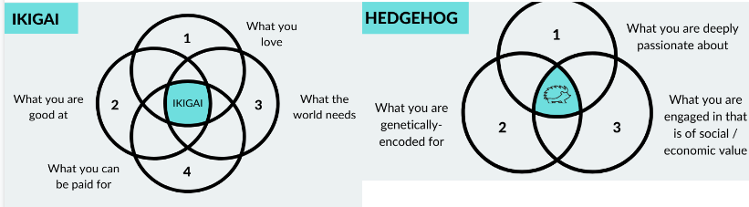
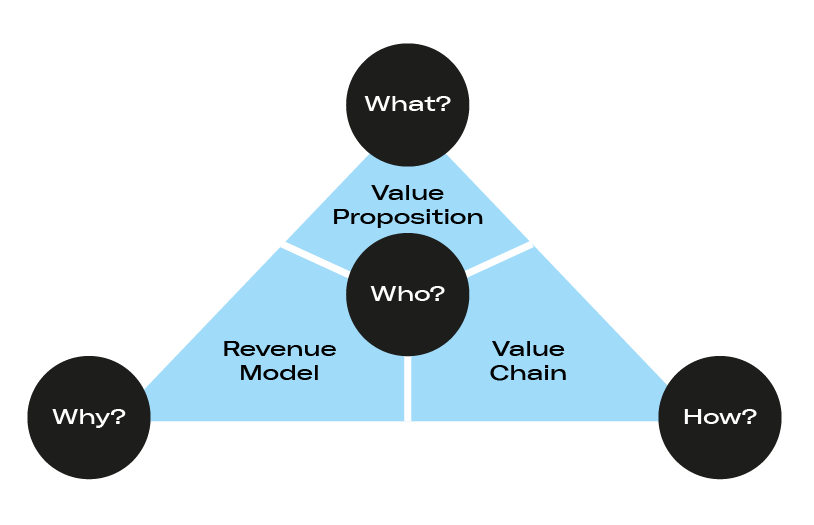
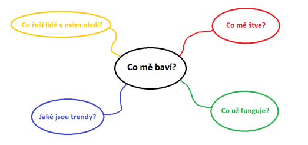

> [!NOTE] Dobrý nápad je jen začátek
> Nápad 10 %, exekuce 90 % úspěchu.

> [!NOTE] Dobrý nápad je jen začátek
> Musíš vědět jaký problém řešíš.

## 1. Intersekce
Způsoby
1. Co mě baví?
2. Různorodý tým - spojit své skills a hobbies
3. Hedgehog
4. Ikigai (smysl života)
5. Co (znalosti) + jak (talenty) + hodnoty (proč)

1. Zájmy
	1. O kterých tématech pořád mluvím? (Možné získat od přátelů)
	2. Co bych chtěl dělat, kdyby peníze nebyly problém?
	3. U jakých témat se zasekávám obdivem na sockách
	- Zkombinovat 1+2 a získáme vášeň
2. Dovednosti
	1. Přátelé říkají, že jsem v tomto dobrý:
	2. Chci se zlepšit v:
	3. Jsem nadprůměrně dobrý v:
3. Dopad
	1. Skupiny, kterým chci pomáhat:
	2. Lokální problémy, které chci řešit:
	3. Globální problémy:
4. Smysl
	- Můj smysl je ... (intersekce daných oblastí)

> [!danger] Pozor!
> 1. Produkt, který technicky nemohu zrealizovat
> 2. Neznámé prostředí

## 2. Řešení problému
- Co trápí lidi? A mě?
- Způsoby
	- *Co trápí obecně lidi v okolí? Co společnost? A co mě?*
	- Probing for pain
		- Vyzpovídat zástupce skupiny (nebo sebe)
			- Co ho trápí?
			- Co mu dělá problémy (jaká práce)?
			- Kde stávající řešení nestačí?
			- Za co by byli ochotni zaplatit?
	- [Metody designu](Metody%20designu.md##Definice problému)
	- [Metody designu](Metody%20designu.md##Výzkumné)
  
  > [!danger] Pozor!
  > 1. Moc malé (niché) trhy
  > 2. Všechno nemá cenu řešit (a ani nedokážu)
## 3. Rip, pivot, jam
Co funguje v zahraničí/v jiných odvětvích a u nás ne?

Kroky
1. Rip (utrhnout) úspěšný model
2. Pivot (otočit) do jiného trhu/sektoru
3. Jam - zisk zákazníků

Příklad - Rohlík, Slevomat

> [!danger] Pozor!
> 1. Copyright
> 2. Ostatním funguje, vám nemusí
> 3. Jiné trhy a nákupní chování

Nebo...
- Změnit 1 ze 4 faktorů
	- „KDO“ je váš zákazník a jaký trh obsluhujete
	- „CO“ mu se svým produktem přinášíte (Value Proposition)
	- „JAK“ mu tuto hodnotu doručujete (Value Chain)
	- „PROČ“ na tom budete vydělávat (Revenue Model)

	  
## 4. Expert enough
- Co umím na 1000/10 bodů
- V čem se na vás obrací ostatní, že potřebují pomoci?
  
  > [!danger] Pozor!
  > Perfekcionismus = brzdič a negativum

## 5. Modernizace/digitalizace/open-source+privacy orientated
- Jaká nová řešení nám umožňují technologie?
- Co ještě nebylo digitalizováno?
- Co by se dalo zefektivnit?
- Co jde předělat na open-source a být transparentní s osobními daty?
- Výhoda budování komunity a effektu Wikipedie (lidé tam píšou, protože to dobrovolné, nikdo je k tomu nenutí a je to benefiční pro společnost)
## 6. Trendy/aktuální výzvy
- Jaké nové potřeby vznikají ve společnosti?
- Co ve společnosti rezonuje? Co je trendy?
- Zdroje
	- Trendhunter
	- Cassandra Daily
	- Springwise
	- Socky (TikTok, IG)
	- [Quantumrun | Explore future trends](https://www.quantumrun.com/)
	- Cíle SDG
	  
	  A nebo...
### Shovels in the gold rush

> [!danger] Pozor!
> Správné načasování

## 7. Myšlenková mapa
**Představ si, že...**
- Vybereš si konkrétní věc nebo problém
- Popřemýšlíš nad jejími částmi, účely a lidmi, kteří s danou věcí souvisí

**Až to budeš mít, potom se ptej:**
- Co se musí stát, aby to naplnilo naše cíle?
- Co se musí stát, aby např. výroba daného produktu byla produktivní a efektivní?
- Jak dosáhneme toho, že daná věc bude více hledět na etické zásady?
- Jak dosáhneme toho, že daná věc bude ještě krásnější?

## 8. Spojit 2 náhodně vylosovaná slova

## 9. Generátor nápadů
- [Startup Ideas powered by OpenAI](https://ideasai.com/)

## 10. Přidat se k existujícímu nápadu
- Podívat se okolo sebe, zda někdo nerozjíždí projekt a nehledá co-foundera
- Kde potkat takové lidi?
	- Tvé okolí
	- Sociální sítě (startupové a podnikatelské skupiny na FB)
	- Podnikatelské akce
		- [New Generation of Founders](http://www.ngof.cz/)
		- [Podnikni to!](https://podniknito.cz/)
		- [Soutěž & Podnikej](https://soutezapodnikej.cz/)
		- [Můžeš podnikat](https://muzespodnikat.cz/)
		- [Disraptors Summit & Competetion](https://disraptors.com/summit/)
		- [czech.events](https://czech.events/)
		- TEDx
		- [Inovační a podnikatelská centra od krajů](https://www.ynovate.cz/cz/kontaktujte-nas#map)
		- Podnikatelská centra od VŠ
	- A další zdroje pro inspiraci
		- Sledovat zdroje na podnikatelské scéně (weby, zahraničí, blogy...)
		- Startup weekendy - [Techstars Startup Weekend](https://www.techstars.com/communities/startup-weekend)
		- Hackhatony
			- [Hackhaton.com Czech Republic](https://www.hackathon.com/country/czech-republic)
			- [Hackathons.cz](https://www.hackathons.cz/)
			- [CEE Hacks](https://www.ceehacks.com/)
			- [Hacker Camp](https://www.hackercamp.cz/)
			- [Junction](https://www.hackjunction.com/)
			- [Slush](https://www.slush.org/)
	- A ještě další zdroje
		- [100+ sources for innovation professionals - Board of Innovation](https://www.boardofinnovation.com/blog/100-sources-that-every-innovation-professional-should-know-about/)

> [!danger] Pozor!
> Projekt by nám měl sedět s osobními hodnotami a vizí
  [Hodnoty, emoce, potřeby, vize](Hodnoty,_emoce,_potřeby,_vize.md)
## 11. Franšíza
- Můžeme získat stabilní příjem s menším úsilím, ale většinou potřebujeme mít větší kapitál
## Zdroje
- [Jak najít dokonalý podnikatelský nápad? | JIC](https://www.jic.cz/magazin/jicblog-jak-najit-dokonaly-podnikatelsky-napad/)
- [LEKCE 1: Od nápadu k podnikání | JICskill](https://skill.jic.cz/lekce/lekce-1/)
- [# LEKCE 2: Kde vzít nápad? | JICskill](https://skill.jic.cz/lekce/lekce-2/)
- [Jak na to: Vyraz na akce, kde jsou další podnikavci jako ty](https://startupbox.app/howto/vyraz-na-akce-kde-jsou-dalsi-podnikavci-jako-ty)
- [Hledej implulzy (nejen) ve startupové scéně](https://startupbox.app/howto/hledej-impulzy-nejen-ve-startupove-scene)
- [How to Get Startup Ideas - Y Combinator](https://youtu.be/uvw-u99yj8w)
- [How to Get Startup Ideas](http://www.paulgraham.com/startupideas.html)