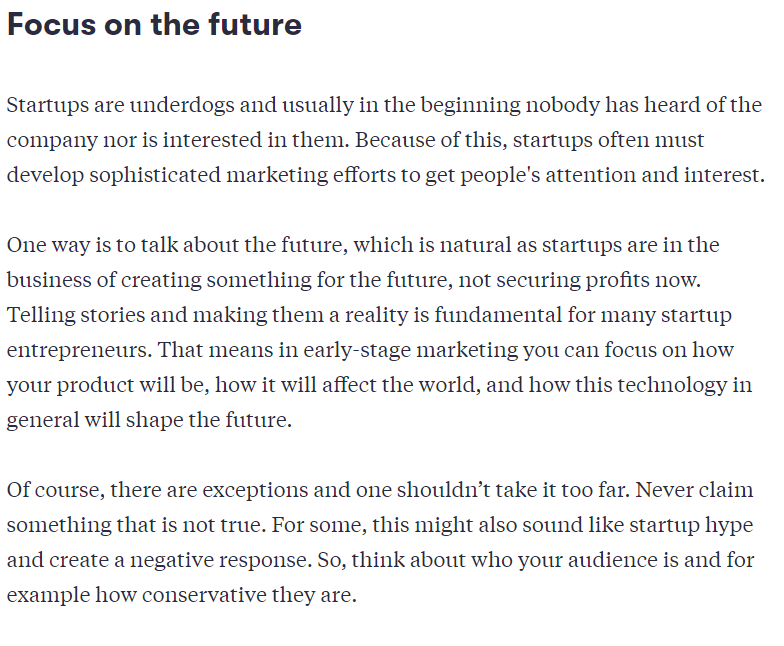

- Don't only focus to product development, but also to marketing and sales je to krev startupu, který ho většinou drží naživu

## Tell the world what you are doing
- Ve většině případů ke lepší začít už předtím než máme MVP nebo řešení
- Začít mluvit o problému, který chci řešit
- Vytvořit landing page/blog/newsletter/příspěvky...
- Když už budeme mít produkt, budeme mít nějakou audience, kterou to zajímá

## Focus on the future

## Fake it until you make it (pozor, kontroverzní)
- Look more advanced and established
	- Máme velký tým
	- Máme sídlo a kanceláře
	- Zveličování významnosti dané technologie
- The idea is that if you get people to believe in you, you will probably be able to gather the resources you need to turn what you faked into a reality
- OK věc, ale reálné věci a nelhat zákazníkovi (případ Theranos, který nasliboval nemožné)

- Try different things, find what works (kanály, cílovky, zprávy, KPIs)

## Typy marketingu
### 1. Reklamy
- Offline - TV, magazíny, offline
- Online - Google AdWords
### 2. Přímý marketing
- Newsletter
### 3. Socky
### 4. Tradiční média
- Dodá kredibilitu
- Rozhodnutí o obsahu je ale na redaktorech
### 5. Influencer marketing and partnership

## Sales
- Most consumer and other low price-point products are sold with automated marketing funnels, but companies with B2B and other high-price products must most often have people doing sales. How sales are done depends on what kind of a product you are selling. Also the business model matters.
- When thinking about how to sell the product, you should think about how the customer can buy this type of product. Think about the price point of the product and, based on that, think about how much time and money you can actually use for selling one product in order for the sale to be profitable. For some cases it’s obvious how the product is sold and you can’t change it, but in other cases you can be creative.
- In the early days for a startup, sales is largely about business development. One can argue that in the beginning, it’s as equally important to receive feedback about the product as it is to generate revenue. It’s also about learning what are the best ways to sell the product.
- Generování příjmů je stejně důležité jako feedback od zákazníků
- [Sales](Podnikání/Sales.md)

## Zdroje
- [Reaching customers | Starting Up](https://courses.minnalearn.com/en/courses/startingup/the-solution/reaching-customers/)