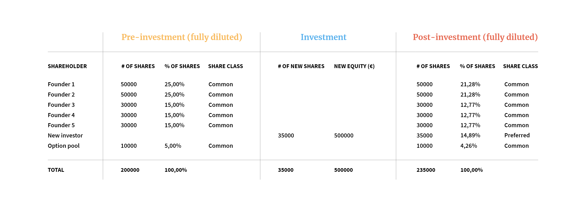

## Správný čas
- Žádný neexistuje
- Je fajn, ale mít už nějaké zákazníky a ověřen trh, abychom nevyhodili peníze
- The moment you’re dedicated to your idea full time and full energy, things move five times faster

> [!cite]
> As long as you have a plan B…it will not become serious and move forward
## Založení
- Měli bychom aspoň vědět
	- Co dělá naše společnost
	- Jak generuje příjem
	- Kolik to bude stát
	- Kde získat správné lidi
	- Z čeho tu budu financovat
## Právník a účetní
### Právník
- Sníží riziko soudu
- A taky jako proof reader pro podepisování smluv, jinak hrajeme ruskou ruletu
### Účetní
- Ušetřit peníze a umožní nám focus na věci co nám jdou
- A taky se v tom orientuje lépe
## Kapitalizace

*Capitalization table, zejména důležitá pro VC a investory.*

- Reflektuje kolik toho každý přináší
- Volit množství akcií dělitelné počtem founderů
	- Pokud nevíme počet tak dělitelné 60, aby mohlo být 1-60 fouderů
- That means you should guard your cap table like your life depends on it. As said before, an ownership structure gone wrong can be a major pain. A long list of shareholders without visible value to the company is not something an investor will be happy to see.
- Ideální je mít co nejkratší seznam

### Option pool
- Employee Stock Option Plan (ESOP)
- For enticing and incentivizing high-caliber people to join a startup
- [OptionPlan | Index Ventures](https://www.indexventures.com/optionplan#expected_funding_rounds_pre_exit=series-b-and-c&employee_country=finland&mode=seed)
- [Vesting](Podnikání/Finance_-_investment_process.md##Vesting) - founders/employees need to stay in the company for a set period before fully owning their shares

### Convertible notes
- Type of loan that can be converted into shares
- Pro rychlé investice
- Tool for bridge funding in between rounds from existing investors to lengthen the company’s runway when it’s clear that the company is about to achieve milestones that have a positive effect on the value

### Investors
|                         | Angels                          | VC      |
| ----------------------- | ------------------------------- | ------- |
| Časový horizont na exit | Dříve                           | 5-8 let |
|                         | Experti a mentoři ve svém oboru | Více zdrojů, partnerů, network        |

- Výhody investora
	- Odpoví na těžké otázky
	- Slouží jako mentoři
	- Kontakty a partneři
	- Kredibilita pro další investory

## Legislativa
- [Legislativa](Podnikání/Legislativa.md)

## Zdroje
- [Setting up your company | Starting Up](https://courses.minnalearn.com/en/courses/startingup/company-formation/setting-up-your-company/)
- [The capitalization table | Starting Up](https://courses.minnalearn.com/en/courses/startingup/company-formation/the-capitalization-table/)