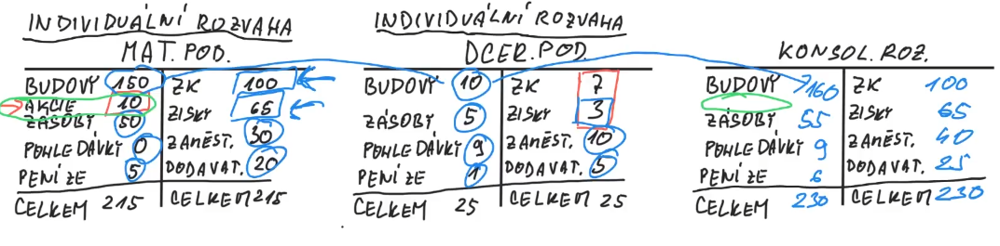

- Dokumenty veřejné v [OR](https://or.justice.cz/ias/ui/rejstrik)
- Účetní uzávěrka
	- Konsolidovaná = celého holdingu
	- Individuální = jednotlivý podnik
- Pro aktiva 3 kolonky (pasiva nelze odepsat)
	- Brutto (hrubé, neupravené)
	- Korekce (odpisy)
	- Netto (výsledek)

## Finanční výkazy
1. Rozvaha
	- Aktiva a pasiva
	- Jako fotka majetku a závazků podniku k určitému datu
	- [Rozvaha](1%20Rozvaha/1%20Rozvaha.md)
2. Výsledovka
	- Výkaz zisků a ztrát
	- Za určité období
	- Jak jsme došli k výsledku hospodaření
	- [Výsledovka](2%20Výsledovka.md)
3. Cashflow
	- Příjmy a výdaje
	- Skutečný tok peněž
	- [Cashflow](3%20Cashflow.md)

## Účel legislativy v účetnictví
1. Informace o finanční situaci a výkonnosti
	- Slouží pro management, věřitele, investory, vládu, dodavatele, odběratele...
	- Měli by být **True and Fair View** (FS a FV by měli být zachyceny co nejvěrněji)
2. Standardizace placení daní
3. Řízení podniku (abychom věděli, jak řídit firmu)
	- Manažerské účetnictví (vnitropodnikové účetnictví)

## Zdroje předpisů
- Daňové účetnictví - stát (MFČR)
- Finanční účetnictví
	1. Kontinentální Evropa
		- Stát pomocí obchodního a podnikového práva
		- ČR - zákon u účetnictví
		- IFRS - mezinárodní standardy účetního výkaznictví
			- Musí dodržovat největší firmy, většinou obchodované na burze
	2. Anglosaské země
		- Finanční účetnictví vymáhají burzy CP, kvůli důvěryhodnosti od investorů
		- USA - US-GAAP (Generally Accepted Accounting Principles) → NYSE

## Kontrola účetnictví
- Daňové účetnictví - stát pomocí Finančního úřadu
- Finanční účetnictví - auditor (povinné pro velké společnosti)
	- Kontroluje nepovolené úpravy a zkreslení informací
	- Konflikt zájmů (auditor je placen prověřovanou společností)
	- Proto auditor obchoduje s důvěrou
		- Pokud je nějaká kauza u auditora, ostatní ho nebudou chtít, viz. kauza Andersen+Enron

## Konsolidace holdingu/koncernu
- Rozvaha a výsledovka za více podniků, jako 1 velký podnik
- Důvody
	- Pro investory, aby nemuseli posuzovat každou společnost zvlášť
	- Proti podvodům, kdy firmy obchodují jen mezi sebou a pak to vypadá že se jim daří
- Mateřský podnik, dceřiné podniky
- Nejčastěji 1 společnost koupí 2. 
- Není to prostý součet rozvah

- Goodwill
	- Rozdíl mezi VK společnosti a cenou co jsme zaplatili za koupi (15-10=5 goodwill)
	- Věříme, že nám to dopomůže k dosažení většího zisku (proto v aktivech)

## Poradce x účetní

| Poradce             | Účetní        | 
| ------------------- | ------------- |
| Ručí za nesprávnost | Neručí za nic | 
| Pozdější odevzdání  | -             |   