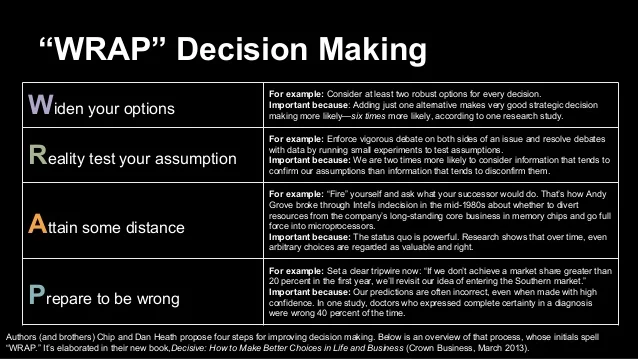

> [!tldr] Moje proč
> Orientovat se podle [[Sebereflexe - Hodnoty, potřeby a emoce]] - moje proč
> Cíle - posouvá mě to k nim?
> Smysl - posouvá mě to ve věcích, co chci dělat?

## Tipy
- Přesně popsat problém/otázku
- *Mohlo by za rok ode dneška mé rozhodnutí mít stále vliv na můj život?**

<a class="rich-link-card" href="https://untools.co/decision-making" target="_blank">
	

		

	

	

	

		<h1 class="rich-link-card-title">Decision making - untools.co</h1>
		

		Collection of thinking tools and frameworks to help you solve problems, make decisions and understand systems.
		

		

		https://untools.co/decision-making
		

	

</a>

## Metody pro rozhodování
### WRAP model

1. Widen your options
	- Napsat víc odpovědí, možná se naskytne fakt skvělá
	- Vanishing options - tell yourself that you cannot choose any of the options you are considering, think of other alternatives, větší kreativita
	- Find Someone Who’s Solved Your Problem
	- Multitrack - Consider AND not OR
	- Consider opportunity cost

2. Reality-Test Your Assumptions
	- Dáváme větší váhu na věci, kterým věříme (beliefs, emotions), jaká je ale realita?
	- Consider opposite - naslouchat druhým, jejich logice, jaké mají argumenty?
	- Outside view  - lidé a jejich názor
	- Zkusit v menším měřítku - v podnikání třeba MVP

1. Attain Distance Before Deciding
	- 10/10/10 rule  - jak se budu cítit a jaký to bude mít vliv za 10min/10měsíců/10let
	- Long term values, goals

4. Prepare to Be Wrong
	- When you’ve made a decision, anticipate and prepare for both adversity and success. 
	- Set a tripwire - jak poznám že se to nezdařilo a měl bych odejít? 

### Budoucí já
- Představit se v budoucnu, 10 minut,10 měsíců,10 let
- 1,5,10 let
- Jaký to mělo přínos? Ve které jsem byl spokojenější?
- Jak se cítím?

## Poradit se s někým
- Dostanu jiný pohled

## Imaginární mentoři
- Pozvat je na setkání třeba do kavárny
- Přesně definovat otázku

### Souboj
- Já s možností 1 vs já s možností 2

### Pro vs proti
- Nebo napsat všechny argumenty pro, proti, vyhodnotit

### Vnitřní pocit
- Co vnitřně chci?
- Hod mincí, co doufám že padne
- A ta nejlepší možnost je… co vyskočí jako 1.

### Náhoda
- Hod kostkou/mincí

## Learn
[Nudge PDF Summary - Richard Thaler & Cass Sunstein | 12min Blog](https://blog.12min.com/nudge-summary/)