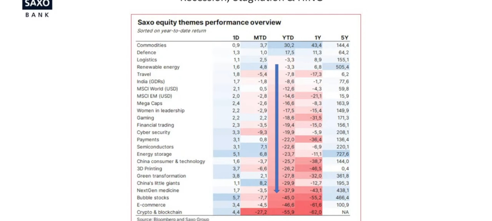
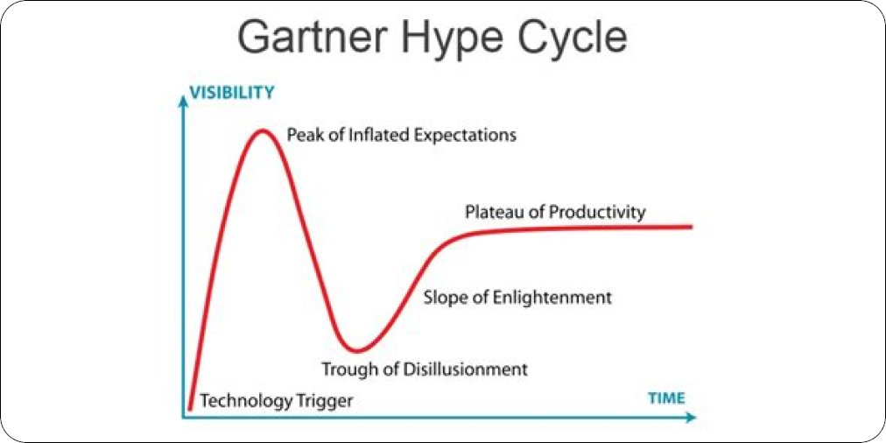
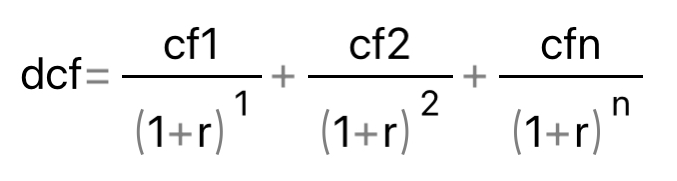
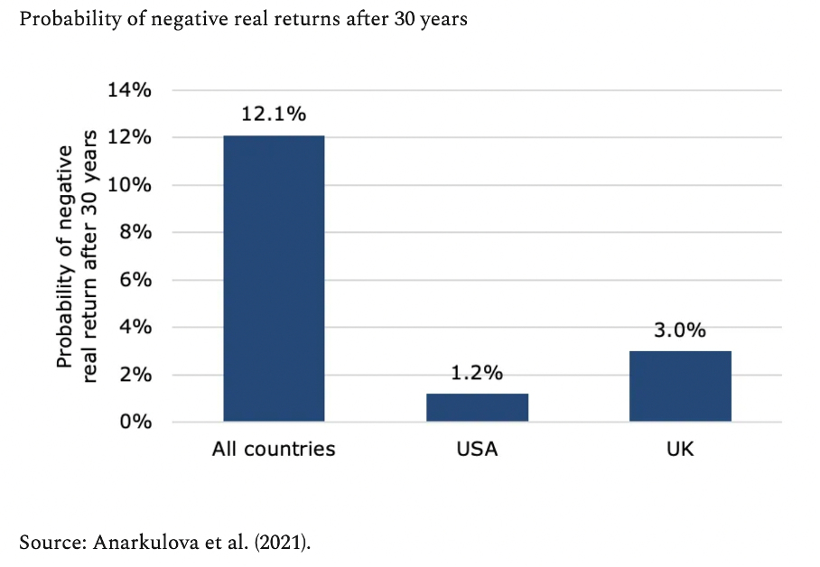
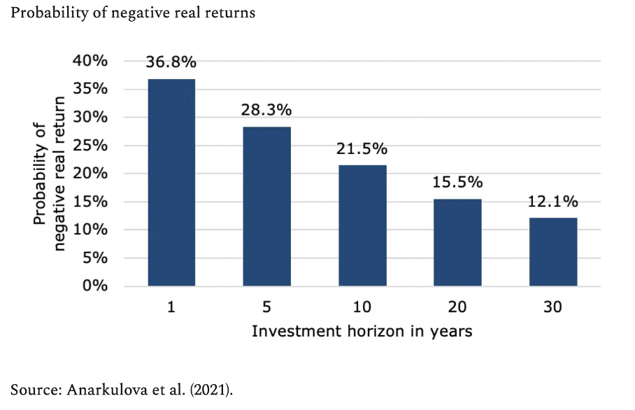
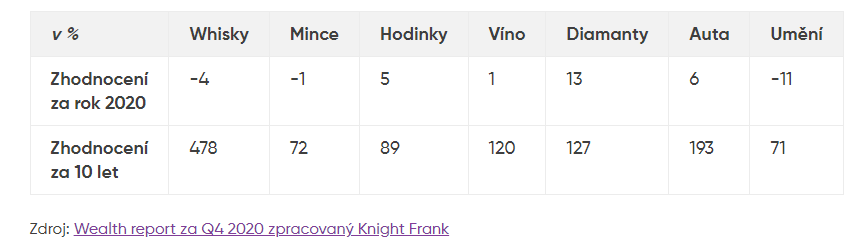

## Kategorie
- Akcie
	- Fondy, ETF
- Dluhopisy
- Komodity
	- Zlato
- Krypto
- Crowdfunding
- Nemovitosti
	- UpVest
	- Rentier
- P2P
- Forex
- Alternativní investice
	- Umění
	- Lego (actually dobrá investice, pokrývá inflaci)
	- Boty

## Tipy
- Screeners
	- [Stockrover](https://www.stockrover.com/)
	- [Nadaq](https://www.nasdaq.com/market-activity/stocks/screener)
	- [Zacks](https://screener.zacks.com/run_screen)
	- [Zacks](https://www.zacks.com/stock/quote/LEN)
	- [Yahoo](https://finance.yahoo.com/quote/LEN?p=LEN)
	- [Finviz](https://finviz.com/screener.ashx?v=111&f=cap_smallover,fa_curratio_o2,fa_debteq_u0.6,fa_div_pos,fa_eps5years_o5,fa_pb_u2,fa_pe_low,fa_sales5years_o5&ft=4&o=country)
- Zdroje
	- Simply wallstreet
	- Gurufocus
	- TipRanks
- [Alternativní data](https://strike.market/stocks)

| Fondy         | Nemovitosti  | Alternativní  | P2P   | Dluhopisy  | Crowdfunding |
| ------------- | ------------ | ------------- | ----- | ---------- | ------------ |
| Fondee        | Investown    | Portu Gallery | Zonky | Státní     |   Fingood           |
| Fonder        | Upvest       | Otis App      |       | Korporátní |          Crowdberry    |
| Indigo Patria | Roier        | Materworks    |       | J&T        |    NaFirmy.cz          |
| Portu         | Ronda Invest |               |       |            |              Seedrs.com|

## Zhodnocení

*Návratnost ve vysoké inflaci*

## Makroekonomické cykly
- Inspirace - Michal Burry
- Indikátory recesí
	- Inverted Yield Curve
	- Výnosová křivka
		- Když se prolomí dolů
	- Cena mědi
		- Když klesá
		- Průmysl potřebuje měď, pokud se mu nedaří nekupují měď
	- IFO
		-  7000 největších podniků a investorů, co si myslí o budoucnosti
	- Fear & Greed index
	- Cena zlata
		- Při strachu stoupá
	- Množství peněz v oběhu

Tištění peněz pomůže
- Firmě dané v zemi, protože nekrachne
- Člověku ubere, skrz neviditelnou daň inflaci
- V zahraničí pomůže spolupracující firmě, protože ví že partner nepadne
- Konkurentovi v zahraničí uškodí, protože on nedostal kapitál, ale konkurent ano

Mýtus bohatých jako zlých
- Filmy je tak zobrazují a lidé tomu i věří
- 1/2 HDP přerozdělí stát, dnes se vymýšlí další důvody jak přerozdělovat ještě větší částku

## Principy

[15 images to memorize](https://mobile.twitter.com/BrianFeroldi/status/1553731179546718208)

[15 investing principles](https://mobile.twitter.com/BrianFeroldi/status/1548637128518770690)

## Gartner Hype Cycle
- Jakmile se o tom píše na Twitteru a mluví v TV, je čas prodat

## Akcie
- Nastavit si cíle
- Vnitřní hodnota
	- Výpočet přes DCF, DDM

*cfn – cash flow za n-rok, r - diskontní sazba*

- Investujeme do reálných společností, kterým rozumím
- Hodnota x cena
	- Great company at fair price
	- Not fair company at great price
- Poučky Warrena Buffeta o akciích
	- Úspěšní lidé říkají na skoro všechno ne
	- Nejlepší doba k nákupu je v období strachu, když jsou trhy dolů a když se o tom nemluví
	- Zajímat se o akcie, když se o ně ještě nikdo nezajímá
- Moje poučky
	- Když už se o tom píše všude na Twitteru a je to na ČT, je čas prodat
- Finanční ukazatele
	- ROE - návratnost vlastního kapitálu, ideálně > 20 %
	- Debt/eq - celkový dluh/velkový kapitál akcionářů
		- >0,5 spíš dluh, < 0,5 spíš kapitál
		- < 0,6
	- P/E
		- Cena/zisk na akcii za 1 rok
		- Kolik let se bude investice splácet, pokud společnost udrží stejné zisky
		- < 15
	- P/B
		- cnea akcie / učetní hodnota
		- < 1, podhodnocena
	- P/S
		- Cena akcie / přijem na akcii
		- 1-3
		- Nepočítá se čistý zisk, ale celkové tržby
	- P/CF
		- Tržní kapitalizace/cashflow
		- <15
	- Stabilní a růstové příjmy (revenue)
	- Net income
		- Čistý zisk
	- EPS
		- Dlouhodobý růst
	- CR
		- Schopnost splácet krátkodobé úvazky
		- Krátkodobé aktiva/krátkodobé závazky
		- > 2
		- Ideálně ne < 1
	- Gross margin
		- > 40 %
		- COGS = cost of goods sold
		- (revenue - COGS)/revenue *100
	- Odkupování vlastních akcií
- VIX
	- Měří volatilitu
	- Pokud vysoké, panuje strach
- Korekce
	- 10-20 %
	- Každé 2 roky
	- Návrat trvá 3-4 měsíce
- Index Aplha pro průměrný výnost trhu
- Ukazatel Beta pro volatilitu
- Pozor na FOMO
	- Impulzivní investování
- Strategie
	- Hodnotová - podhodnocené akcie, dlouhodobé
	- Růstová - s růstovým potenciálem
- Margin of safety
- To že něco rostlo v minulosti neznamená, že poroste i v budoucnosti
- Čas prodeje
	1. Společnost má problémy
	2. Cena je vysoká a její ocenění nedává smysl
	3. Máme lepší investici
	4. A nebo jsme udělali špatné rozhodnutí, nemá smysl dál držet a být bag holder
- Neposlouchat doporučení analytiků
- Kontrolovat max. 1 za měsíc

## Komodity
- 0-30% z toho ve fyzické podobě

### Zlato
- 15-20 % portfolia
- Není to investice, ale alternativní peníze, které ochrání v krizi
- Dlouho vyčkává na podněty, které ho vystřelí
- Anonymita při koupi
- Mince
	- Rychlá konvertibilita (těch uznávaných, v Evropě to jsou Filharmoniky)
	- 1 oz mince jsou nejvýhodnější velikost mincí (nejmenší fee a spread)
- Bars
	- Good Delivery

- [Kniha Jak na zlato](../Knihy.md##Jak_na_zlato)

<iframe height="500px" width="100%" src="https://inflationchart.com/gold-in-cpi/?show_stock=0&show_adjuster=0"></iframe>

## Dluhopisy
- Výpočet přes budoucí peněžní toky, diskontování
- Zadluženost společnosti, její historie

## Nemovitosti
- Pronájem
	- Inflační doložka
	- Idiot proof it (udělat to nerozbitelné)
- Platformy
	- UpVest
	- Rentier
	- Fondy pro lesy, pole, farmy...
- [Cenová mapa a odhad cen | Reas.cz](https://www.reas.cz/)

## Alternativní
[Alternativní investice - Průvodce začínajícího investora - CzechCrunch](https://cc.cz/pruvodceinvestora/alternativni-investice/)

### Umění
- Portu Gallery

### LEGO
- [Lego a investování](https://www.sciencedirect.com/science/article/abs/pii/S0275531921001604)

### Boty
- Nějaké boty nejsou ideální na dlouhodobý hold (začnou se ničit)

## Links for first time
- [Průvodce začínajícího investora - CzechCrunch](https://cc.cz/pruvodceinvestora/)
- [Vojta žižka - Jak správně začít investovat - YouTube](https://youtu.be/EFLz4rgmYWc)
- [Lukáš Kovanda - Jak investovat v čase „generační inflace“? - YouTube](https://youtu.be/l65rkuynN9w)