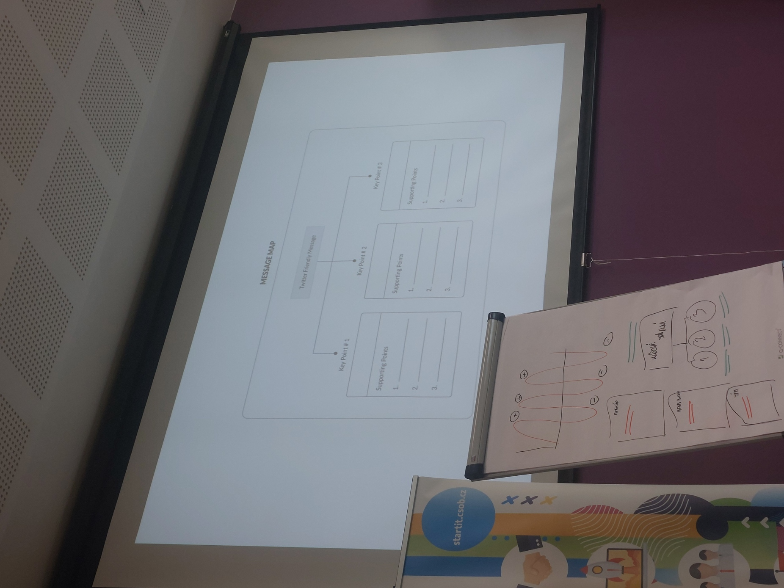
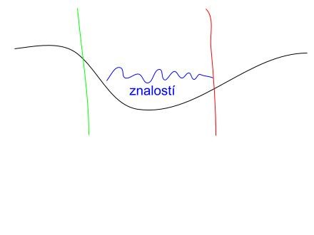
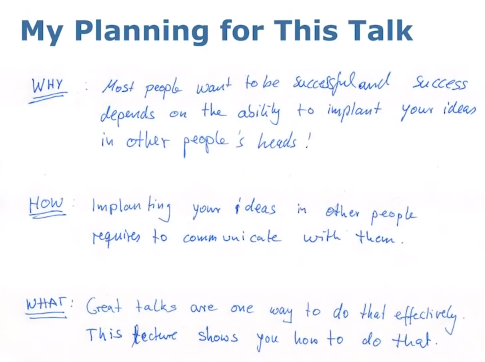
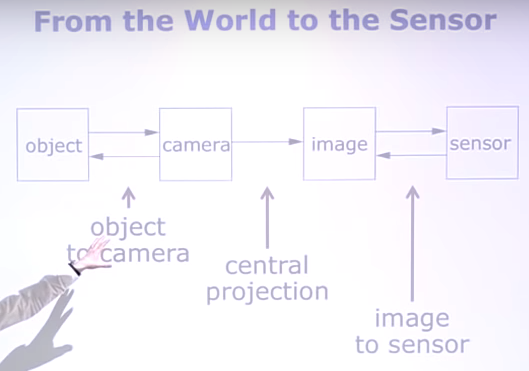
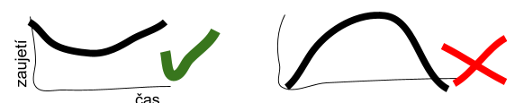
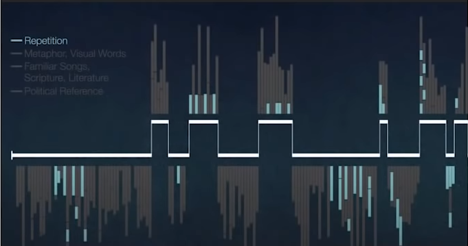
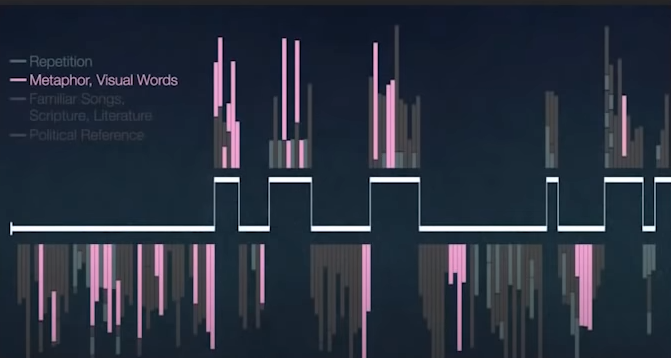
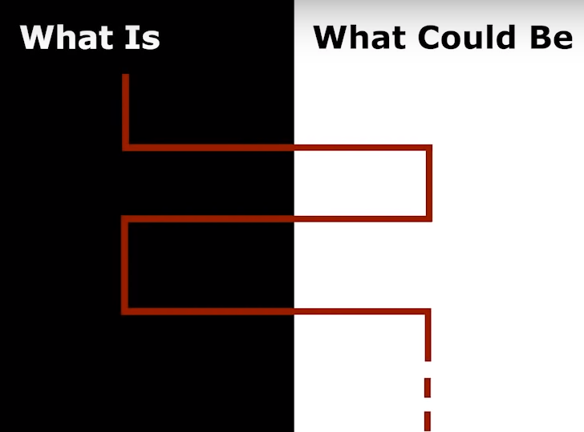
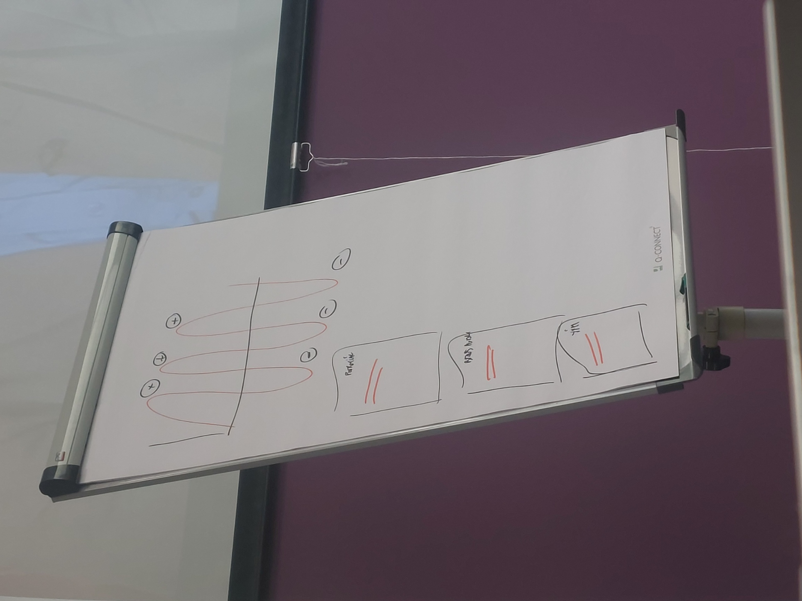
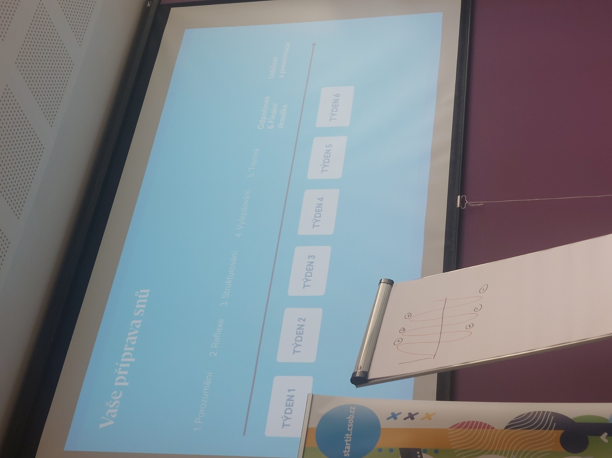

## Cíl
- Nejdřív si ujasnit cíl prezentace, pak až strukturu
- Zaměřený na posluchače - *Kdo, co kdy, kde, jak?*
- Musí být
	- Specifický
	- Měřitelný
	- Zaměřený na publikum
		- Míra expertízy
		- Jazyk, věk - terminologie
		- Dobrovolnost
		- Zájem, pozornost
		- Nedobrovolné - nejprve přesvědčit, že nejsem debil a proč by je to mělo zajímat
		- Formální/neformální
		- Jakou formu bude mít prezentace?
		- Typ prezentace: pitch/přednáška...
		- Co chci, aby si odnesl (začátek, konec)
		- Proč by je to mělo zajímat?
		- Proč? Jaká je jejich motivace, po čem jdou?
	- Podle očekávání a kontextu
	- Den a hodina
	- Realistický (i časově)
- CTA (call to action)
- Klíčová sdělení
	- Reaguje na to PROČ publika
	- Mapa sdělení - key statement rozdělen na podpůrná sdělení

## Struktura
- Vymyslet příběh v hlavě, pak PPTX

### Sucháčkova vana

- Úvod
	- Ponořit do tématu
	- O čem budu mluvit, proč by je to mělo zajímat, kdo jsem...
- Stať
	- Máchání ve znalostech
	- Na hraně je shrnutí
- Závěr
	- ==NEZAPOMENOUT VYNOŘIT
	- Jaká je message? Call to action?

- Metoda přímky
	- Nakreslit si timeline z bodu A do B s časy
	- Kapitoly na sebe logicky navazují

### Brainstormingová
1. Sepsat koncepty (brainstorming nápadů a obsahu, madman, mindmap [[Kreativita]])
	- Hrdinové (lidé)
	- Části
	- Rekvizity, pomůcky
	- Výzvy
	- Myšlenky, citáty
	- Cokoliv...
2. Nechybí tam něco?
3. Poskládat strukturu (carpenter) a vyfotit (tato bude konzervativní)
4. Poskládat jinou strukturu a vyfotit (tato už je víc rebelská)
5. Poskládat ještě jinou strukturu
6. Vybrat finální

### Jednoduchá
- *co chcete říct, pak to řeknete a potom řeknete, co jste řekli*

### BIKER B
1. Bang!
	- Posluchače zaujměte
2. Introduction
	- Nastiňte hlavní body, kterým se budete věnovat
3. Key points
	- Uveďte konkrétní důležité body prezentace a věnujte jim odpovídající množství času
4. Examples
	- U každého hlavního bodu uveďte alespoň 1 konkrétní příklad zvolený s ohledem na cílovou skupinu posluchačů
5. (Otázky?)
	- Před shrnutím kvůli recency efektu
	- Pokud nevíme, slíbit, že jim ji zjistíme a pošleme
6. Recap
	- Zopakujte hlavní body a shrňte vše, co by si přítomní měli z prezentace zapamatovat
7. Bang!
	- Prezentaci ukončete

### Made to stick out
1. Start strong
2. Empowerement promise
3. No outline slide
4. Your stuff
5. Call to action
6. End

#### 1. Start strong
- Never excuse for not preparing (wasting whole audience time)
- How to start
	- Question
	- Story
	- Bold statement
	- Statistic
	- Challenge/quiz
	- What's in it for you? What you're going to learn?
	- Insight (problem statement)
		- Stručný ale hluboký vhled do problematiky
		- Nastavujete očekávání, že problematice, o které budete mluvit, rozumíte, ostatní by se s problémem měli ztotožnit (vhodné ověřit dotazem)
		- Vykreslit problém
		- A pak představíme řešení
		- Call to action
	- Icebreaker
		- Aktivita na rozehřátí
- Start with why?
	- [S. Sinek Why?](S._Sinek_Why?)
	- Proč by měli poslouchat?

#### 2. Empowerment promise
- What will you be able to do after this talk?

#### 3. No outline slide

#### 4. Your stuff
- Reentry points (people get bored and sometimes get lost)
	- Go back to big idea slide and structure

*Příklad využití diagramu struktury*

#### 5. Call to action
- Read/discuss/cite/use

#### 6. End
- Key lesson learnt, your key contribution...
- Don't thank, just say you ended look forward to Q&A or ...
- **Celebrate success afterwards**

## Make information stick
### Recency (poslední věci) a primacy effect
- [Learn to Analyze Martin Luther King Jr.’s Speech by Breaking Down the Text into Shapes - YouTube](https://youtu.be/l39CL0t-jyM)

### Repetetion

### Make people visualize words 

### Contrast
- Use reality and similarity effect, what people feel, live...
- Aspire them with their dreams

### Similarity effect
- Familiar things, things people relate to

### Emotions
- Person with name, story with emotions
- [Tell stories](Social_-_Storytelling.md)

### Made to stick
- [Made to Stick - Wikipedia](https://en.wikipedia.org/wiki/Made_to_Stick)
- (You don't have to do all of them)

- Simple
	- Simple message, the core idea
	- Zkus jednoduše vypíchnout to opravdu podstatné. Tak, aby nad tím lidé nemuseli přemýšlet. A hned věděli, co jim chceš říct. Jednoduché sdělení bez zbytečných detailů, které odvádí pozornost. Zkrátka – jak se lidově říká – jasné jak facka. Pomoci Ti může také metafora nebo analogie, díky kterým si lidé Tvoje sdělení dobře představí.
- Unexpected
	- Unexpected elements, surprise creates attention
	- Jak probudit zvědavost? Zkus najít na tvém tématu něco jedinečného, překvapivého, co lidé neočekávají… Zkrátka neboj se vystoupit ze stáda. A vsaď se, že uspěješ a získáš pozornost potenciálních zákazníků.
- Concrete
	- Concrete use case than generalization, easier to remember
	- Buď konkrétní. Popiš lidem například produkt tak, aby si to uměli dobře představit. Názorně. Konkrétní věci si vždycky lidé představí lépe než abstraktní koncepty. Ideálně k tomu použij svůj prototyp. 
- Credible
	- Are you credible? make it trustable, data, studies
	- Buď uvěřitelný. Pomoci mohou jasná data nebo odkaz na autoritu – někoho, koho lidé znají a respektují. Vzbudit důvěru, že něco „opravdu funguje“ je u tvých potenciálních zákazníků je základem úspěchu
- Emotional
	- Emphasizes importance
	- Lidi se zajímají o lidi. A o to, co ostatní lidé cítí. Když do tvého marketingového sděleni zapojíš emoce, máš vyhráno. Zkus se také zamyslet proč je tvoje sdělení pro lidi důležité. Mohou si ho nějak propojit se svým životem?
- Stories
	- Builds a narrative around it
	- Za dobrým marketingem je často silný příběh. A jaký bude ten tvůj? Jakou máš motivaci k rozjetí podnikání? Jaký problém můžeš vyřešit? Zkrátka – proč to všechno děláš?

## On stage
- Úvod a závěr nazpaměť
- Interakce s publikem (vtipy, gify, rhetorical questions…)
- Body language
	- Fyzická atraktivita - vypadáme chytřejší (Halo effect)
	- Způsob jakým vejdeme do místnosti - první pohled
	- Ruce ve čtverci na hrudi
	- Otevřená řeč těla
	- Nikdy zády
	- Hlas
		- Mluvit k poslední řadě
		- Střední tón
		- Artikulace
		- Tempo
	- Be relaxed, comfortable
	- Consistency of body language (words match gestures)
	- Ruce před hrudí
	- Gestures
	- Slow down
	- Filler words
	- Learn 1st sentence for every slide
	- 1 message per slide
	- Interact with screen
		- Don't show your back, instead slightly turn
	- Don't sit
- Environment
	- Darkness invites sleep
	- Microphone (ask for remote one)
	- No physical barriers between you and audience
	- Prezentér
	- Ideálně mezi 10-12 h
- Praktice
	- ACAP (as close as possible) - vyzkoušet na ostro se vším všudy
	- Ideálně se natočit zkouknout a poslat to někomu na feedback
- Complementary props
	- Props - memorable and ideal for explaining and understanding
	- Blackboard - too slow
	- Flipchart - rychlejší
		- Ideální pro interakci s publikem a workshopy
	- Slides
		- Lidé buď poslouchají nebo čtou prezentaci, nikdy obojí
		- Min. 30 font size
		- Less is more
		- 1 idea per slide
	- Vždy nemusí být PowerPoint
- Timing
	- Otestovat (ACAP)
	- Časová rezerva
	- 1 slide vychází většinou na 120 s
	- Skip stuff by entering number of slide not with pointer
	- Při delší prezentaci (+ 30 min) udělat přestávky
- To not be bored
	- Integrate audience feedback on the fly
	- Improvise
	- Be passionate
	- Stimulate interest
	- Your intent
		- Instruct, inform, convince, act, sell, entertain
		- Understand, memorize, focus, inspire
	- Mindset
		- Love your topic
		- Love your slides
		- Love your props
	- B on keyboard (blackens the screen) - focus on you, tell important thing
	- Key messages
	- Metafory, analogie
- Pravidelně se ujišťujte, že vám vaši posluchači rozumějí
- Konkrétní čísla, jména...

## Tipy
- Náš tým - využít silných stránek
- Emoce a příběh
	- Dokončit příběh, vrátit se k němu
- Na konci key message
- Problém a jeho řešení
- Nadšení + expertíza/kredibilita (věřím mu?)
- Emoce, fakta, kredibilita (proč zrovna já)
- Chyby: podceňování value proposition (žádný přínos), žádná kredibilita (jsem nezkušený)
- Získat potom zpětnou vazbu
- Emoce
	- Emoční rollercoaster
		- Pozitivních a negativních
		- Vtipných a vážných 
	- Lidé si pamatují emoce
- Prezentační zážitek
- Grafiku dělat až na konec
- Držet sekci a headline catchy a suprising
- Vytvořit jedinečný zážitek
	- Přinést demo, prototyp, scénka, hudba, video, gify, interaktivnost...
- Co je naše big story?
	- Čím chceme změnit svět?

## Rétorika 2
- Správné postavení
	- Nohy
	- Pánev
	- ramena
	- Hlava
- Dýchat do bránice
- Cvičení hea na bránici
- Rozmluvení/rozehřání mimických svalů
	- Jazykolamy
	- Mluvení s korkem (nakousnout a mluvit u toho)
- Improvizace/připravené
	- Improvizece - být 3 věty dopředu před divákem, mít myšlenku
- Filler words
	- U debat, pro srozumitelnost OK
	- U prezentací použít spíše nádech
- Prezentace je komplement, ne to co mám přečíst
- Gesta pro zdůraznění/zapamatování
- Imaginative words, that make the audience imagine sth

## Tools
- Hezké grafy a statistiky - [Information is Beautiful](https://informationisbeautiful.net)

## Typy prezentací
### Startup pitch
- Šablony prezentací pro pitch - [Slidebean](https://slidebean.com)
- Nemusí nutně být problém, ale jen příležitost, která nebyla ještě využita

#### Elevator pitch (30 s)
1. Představení
	1. Co chci?
	2. Co nabízím?
2. O co jde
	1. 1 věta
	2. Jaký problém řešíme (problém), komu pomáháme (cílovky), čím je projekt výjimečný (USP, unfair advantage)
3. Srozumitelný opis

Byl jednou jeden ___________(jméno zákazníka). (Jméno zákazníka) + (krátký popis zákazníka). (Jméno zákazníka) měl každý den/ často problém s _____________, kvůli tomu problému se mu nedařilo __________. Až najednou objevil _________(název tvého projektu, nápadu). Díky (názvu tvého projektu) se mu podařilo _____________ (řešení jeho problému) a ještě navíc _____________ (další přínosy, které mu tvůj nápad přinesl a jsou nad očekávání zákazníka). 

- Made to stick
	- Simple
		- Zkus jednoduše vypíchnout to opravdu podstatné. Tak, aby nad tím lidé nemuseli přemýšlet. A hned věděli, co jim chceš říct. Jednoduché sdělení bez zbytečných detailů, které odvádí pozornost. Zkrátka – jak se lidově říká – jasné jak facka. Pomoci Ti může také metafora nebo analogie, díky kterým si lidé Tvoje sdělení dobře představí.
	- Unexpected
		- Jak probudit zvědavost? Zkus najít na tvém tématu něco jedinečného, překvapivého, co lidé neočekávají… Zkrátka neboj se vystoupit ze stáda. A vsaď se, že uspěješ a získáš pozornost potenciálních zákazníků.
	- Concrete
		- Buď konkrétní. Popiš lidem například produkt tak, aby si to uměli dobře představit. Názorně. Konkrétní věci si vždycky lidé představí lépe než abstraktní koncepty. Ideálně k tomu použij svůj prototyp. 
	- Credible
		- Buď uvěřitelný. Pomoci mohou jasná data nebo odkaz na autoritu – někoho, koho lidé znají a respektují. Vzbudit důvěru, že něco „opravdu funguje“ je u tvých potenciálních zákazníků je základem úspěchu
	- Emotional
		- Lidi se zajímají o lidi. A o to, co ostatní lidé cítí. Když do tvého marketingového sděleni zapojíš emoce, máš vyhráno. Zkus se také zamyslet proč je tvoje sdělení pro lidi důležité. Mohou si ho nějak propojit se svým životem?
	- Stories
		- Za dobrým marketingem je často silný příběh. A jaký bude ten tvůj? Jakou máš motivaci k rozjetí podnikání? Jaký problém můžeš vyřešit? Zkrátka – proč to všechno děláš?

#### Deck (krátká prezentace, 10-20 slidů)
- Problém
- Řešení
- Proč my?
	- Příběh, který k tomu vedl, motivace
	- Unfair advantage
- Kde jsme, v jaké fázi (roadmap)
- Struktura:
	- Start
		- Problém, situace, příběh
	- Middle
		- Řešení
		- Co chceme
		- Co nabízíme
	- End
		- Silný závěr
		- Třeba zpět k závěru
- Customer journey
- Proč si zvolili naše řešení a ne jiné?
- Představit MVP
- Validace MVP
- Co chci, aby si odnesli? Co vůbec chci od nich? Call to action?
- Rozkouskovat problém na menší části
- Připravit se na dotazy

### Lecture
- Educate and instruct
- Train the next generation
- Avoid boredoom
- Slides vs document - create 2 presentations

### Konference
 - Sharing idea is not main goal
- Action: read, discuss, cite, use
- Short time - do it like an advertisement
- Why buy it? What does it enable?
- Simple, do not explain the full paper
- Emotional, emphasize idea coolness
- Credibility, back up claims

### Thesis defense
- Audience wants to find out:
	- Novel research?
		- What was impossible before and is possible now?
	- Pushed the state of the art?
		- What are my key contributions?
	- Can you present, discuss, defend your work
- Credibility, back up claims
- Explain to people outside of field
- _Pokud prezentujete např. svou diplomovou práci, nejprve řeknete, co byste v prezentaci rádi předali – že budete mluvit o tématu práce, o hypotézách, o praktické části, o teoretické části, o prostředcích atd. Následně v jádru prezentace řeknete, že téma práce bylo X, hypotézy byly Y, použili jste prostředků Z, … Na závěr zopakujete, co jste řekli – tj. jaké bylo ve stručnosti téma, co jste zjistili, jestli jste získali podporu pro své hypotézy atd._
- T-profile talk
	- - top of T, everybody understands it
	- I line down, 1 point on expert level

### Proposition defense
- Audience wants to find out:
	- Is the work novel and exciting?
	- What is the expected change?
	- Right team?
	- Money well-inveseted?
- What is vs what could be?
- How will you push the state of the art?
- Past achievements
- T-profile talk
	- - top of T, everybody understands it
	- I line down, 1 point on expert level

### Academic interview
- Audience wants to find out:
	- Evaluate potential for outstanding research. Will he do great job in future?
		- Past achievements and experience?
	- Fit to the position/...?
		- Why do I think I am fit to this position?
	- Can you educate the next generation?
- Your vision
	- Your achievements
	- Next steps toward your vision
- T-profile talk
	- - top of T, everybody understands it
	- I line down, 1 point on expert level

## Learn
- [Talks That Don't Suck - A Guide to Improve Your Talks (Cyrill Stachniss)](https://youtu.be/Rfo5dFD3DLQ)
- [Learn to Analyze Martin Luther King Jr.’s Speech](https://youtu.be/l39CL0t-jyM)
- [Made to Stick | Wikipedia](https://en.wikipedia.org/wiki/Made_to_Stick)
- [Prezentace nápadu | JICskill](https://skill.jic.cz/lekce/lekce-7/)
- [Prezentace | Youniversity](https://youniversity.cz/modul/prezentacni-dovednosti)