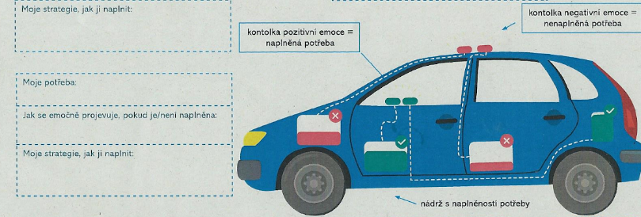
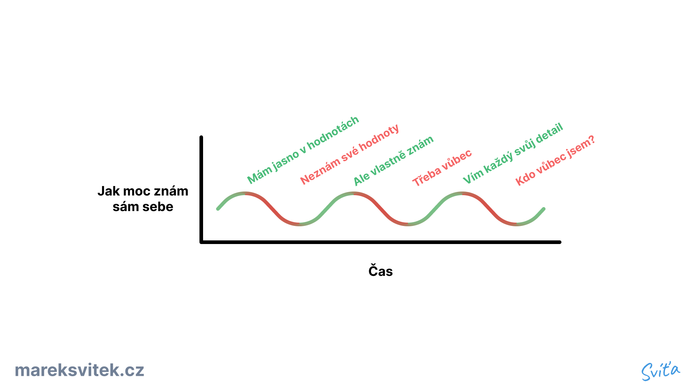
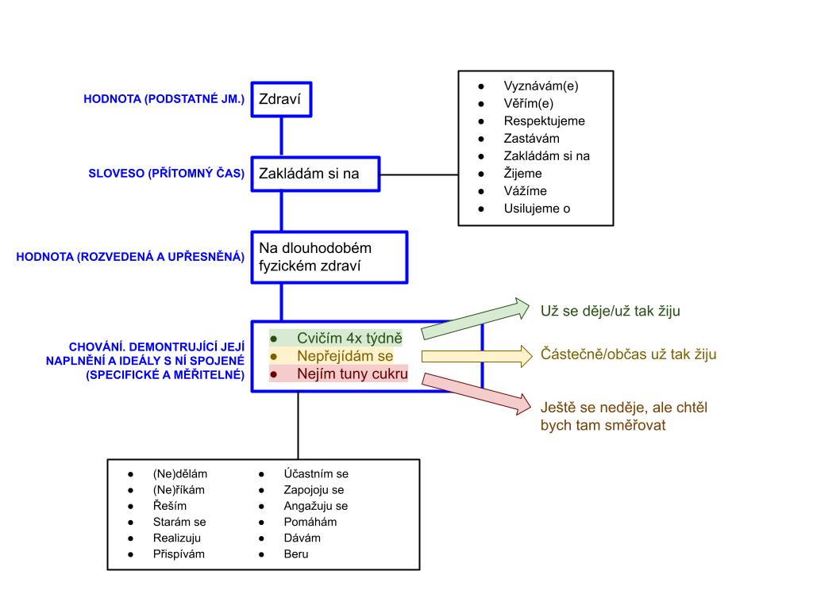
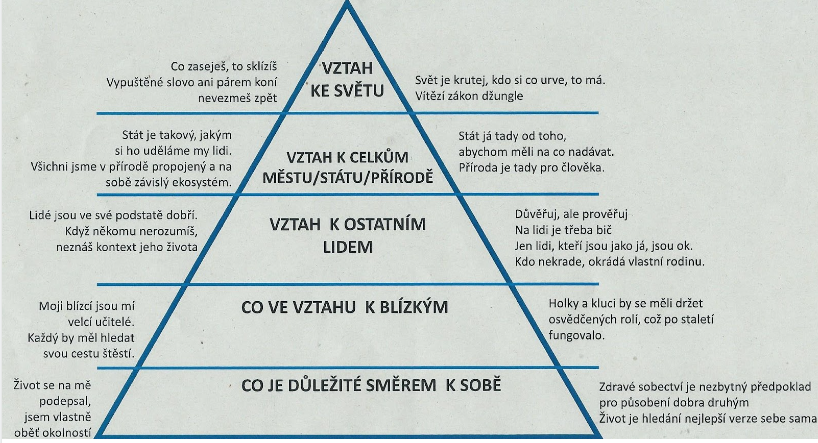

## Emoce jako projevy potřeb
- Emoce nevnímat emoce jako nepřátele, nejsou zlé ani špatné 
- Emoce jsou projevy (ne)naplnění potřeb a kvalit
- Stejně jako fungují kontrolky u auta, když je něčeho nedostatek, i naše tělo má své kontrolky ve formě emocí.
## Jak přijít na své potřeby
1. [Vzít si kartičky pocitů](https://nenasilnakomunikace.org/wp-content/uploads/2021/01/karticky-pocity-nvc-v2.pdf) a zeptat se: *Jak se cítím? Jak jsem se cítil včera? A tento týden?*
2. Pak si vzít [kartičky potřeb](https://nenasilnakomunikace.org/wp-content/uploads/2021/01/karticky-potreby-nvc-v2.pdf) a zamyslet se nad tím co tyto emoce způsobilo, ke každému pocitu přiřadit potřebu

- Místo papírových kartiček existuje i [appka](https://nenasilnakomunikace.org/stahnete-si-cviceni-s-kartickami-potreb-a-pocitu/)
- Podrobnější popis cvičení:
	- [Nenásilná komunikace](https://nenasilnakomunikace.org/stahnete-si-cviceni-s-kartickami-potreb-a-pocitu/)
	- [Komunikace Srdcem](https://www.komunikacesrdcem.cz/jak-pracovat-s-kartickami-pocitu-a-potreb/)
## Práce s hodnotami

- Každá hodnota/potřeba lze naplnit různými způsoby, proto je dobré mít **předchystané způsoby, jak své hodnoty naplnit**
- Praktické otázky:
	- *Co můžu udělat pro to, abych je naplnil?* (Třeba si mohu vyhradit ohraničený čas, který mi mi udělá dobře a naplní potřeby/hodnoty)
	- Někdy při naplňování je potřeba dělat kompromisy s povinnostmi
	- *Jak můžu zmenšit zlo v aktivitách co musím dělat? (Co jde v mém životě proti mým hodnotám)?*
## Objevování hodnot
1. *Jak se mám? Co to způsobilo? (Jaká hodnota?)* Viz. cvičení nahoře
2. *Popiš ve zkratce 3 vrcholné krásné zážitky za posledního 1,5 roku. Proč je vrcholný? Jaká hodnota byl naplněna?*
3. *Popiš ve zkratce 3 vrcholné opravdu nepříjemné zážitky za posledního 1,5 roku. Proč jsou tak deprimující? Jaká hodnota byl naplněna?*
4. Pojmenuj 3 aspekty/kvality tvého života, bez kterých si ho nedokážete představit. Proč?
5. *Co mě žene do projektu? Jaká je má motivace? Proč?* ([S. Sinek Why?](S.%20Sinek%20Why?))
## Popisování hodnot

- Hodnoty lze uchopit různě, ale jak s danou hodnotou pracuji? Jak to dělám já?
- Například mám hodnotu *rodina*, mohu ji uchopit různými způsoby:
	1. Zakládám si na hlubokých vztazích v rodině (a proto se třeba věnuji každému členovi jednou týdně)
	2. Rodina na 1. místě (a proto třeba se točí můj svět okolo rodiny)
## Okruhy hodnot

## Bonus - Inspirující osoby
- Osoby, které obdivuji, mi mohou sloužit k inspiraci. Proto když mám problém a nevím jak ho řešit, je možné, že v minulosti řešili naprosto stejný. Možným řešením na problém může být popovídat si s nimi nebo si přečíst jejich biografii.