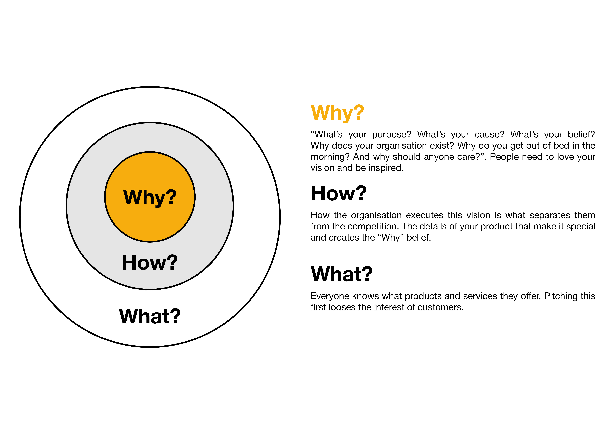
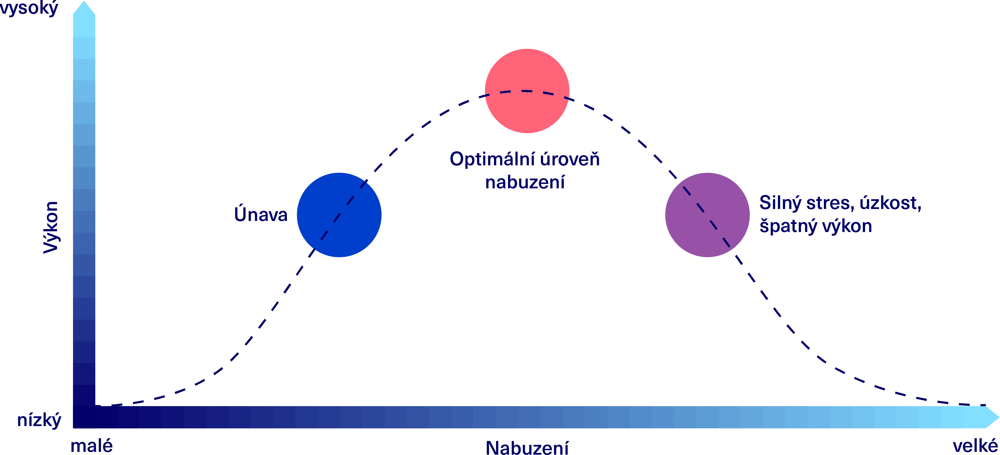

> [!tldr] 
> Dlouhodobě je nejdůležitější vnitřní motivace.

- =proces, který nám pomáhá dosahovat cílů a celkově reguluje naši činnost
- Vliv na ni má mysl, která se zabývá a pamatuje více nedokončené úkoly (efekt Zeigarnikové)

## Vnitřní x vnější motivace
## Simon Sinek - Golden Circle
- Moje proč?
- Zoom out on the big goal, where am I heading?
- [Sebereflexe - Poslání a vize](Sebereflexe_-_Poslání_a_vize.md)
- [Hodnoty, emoce, potřeby, vize](Hodnoty,_emoce,_potřeby,_vize)

<iframe src="https://embed.ted.com/talks/lang/en/dan_pink_the_puzzle_of_motivation" width="854" height="480" style="position:absolute;left:0;top:0;width:100%;height:100%" frameborder="0" scrolling="no" allowfullscreen></iframe>

- Odměny v práci často nefungují
	- Zmenší náš focus jen na daný task a omezí naši kreativitu
		- Dobré pro jednoduché mechanické úkoly, které mají jen 1 správný výsledek (třeba balení zásilek)
		- Špatné pro úkoly s potřebou alespoň trochu myšlení nebo kreativity, kde větší odměny vedou k tím víc horšímu výkonu

### 3 key principles
1. Autonomy
	- Management is only great for compliance
	- Self-direction is great for engagement
		- Get money problem off the table, pay them good
		- Give them lots of autonomy
		- Give people 20 % time to work on anything they want
			- Smaller version - 24 hours to deliver something that dosnít corelate w/ usual job
			- Bigger version - ROWE (results only work environment)
			- Wikipedia vs Microsoft
2. Mastery
3. Purpose

## Teorie výkonové motivace
- Volit úkoly, které mírně přesahují úroveň našich dovedností
	- Ty nás motivují učit se novým věcem a zdokonalování, při splnění přinášejí uspokojení
	- Snadné úkoly, naše dovednosti se nebudou zlepšovat a budeme stagnovat
	- Příliš náročné úkoly, může se stát, že ztratíme motivaci, neboť budeme zažívat častý neúspěch a pocit bezradnosti

## Yerkes-Dodsonův zákon
- Přílišná „přemotivovanost“ škodí
- Stejné se stresem při prezentaci (je třeba balanc stresu)

## Efekt cílové pásky
- Motivace často roste před finishem/deadlinem/termínem zkoušky/metry do cíle v běhu...
- Lidé mají na konci tendenci přidávat, výhodnější je to ale rozložit, ne na konci dohánět

## Koučování
- =rozhovor, kouč pracuje s klientem na cílech, které si určí. Maximalizuje potenciál klienta a staví na klientových silných stránkách, zkoumá co funguje a co se dá ještě zlepšit.

### Zázračná otázka
- Vymyslet nějakou oblast svého života, ve které se vám nedaří a chcete ji zlepšit.
	- Představte si, že se dnes v noci, zatímco budete spát, stane zázrak – a v oblasti vašeho života, kterou jste si zvolili, se vám už skvěle daří. 
	- Podle čeho si toho všimnete?
	- Co bude jinak?
	- Kdo by si toho všiml jako první?
	- Podle čeho?
- Tím si představíme cíle, pomůže nám k vymyšlení konkrétních kroků

### Jak správně klást otázky
- Cíl hledat nová a neobvyklá řešení

1. *Co už jsi vyzkoušel(a)? Co ještě? Jak to fungovalo?*
2. *Jaký je tvůj cíl? Co pro to můžeš udělat teď? Co zítra? Co za měsíc?*
3. *Jaké další zdroje můžeš využít? Kde najít pomoc? Koho se můžeš zeptat?*

- Využít imaginárních mentorů

Kniha - [Coaching Questions](../../Knihy.md##Coaching_Questions)
## Metoda škály
- Na viditelné škále si zaznamenat aktuální stav a vzdálenost do cíle
- Tím si rozdělím cíl na menší dosažitelné kroky

## Kaizen (continuous improvement)
- Rozdělit úkol do menších úkolů 

<iframe width="400" height="260" src="https://www.youtube-nocookie.com/embed/yC3S9e7yl_0" title="YouTube video player" frameborder="0" allow="accelerometer; autoplay; clipboard-write; encrypted-media; gyroscope; picture-in-picture" allowfullscreen></iframe>
[[Time management#Kaizen]]

## Model GROW
- Nice way to get unstuck
1. Definovat cíl (ideálně SMART)
2. Zaměřit se na současnost, jak to s daným tématem vypadá v danou chvíli
3. Hledání možných řešení a otevírání nových příležitostí
4. Action steps

![[../../Assets/Seberozvoj/Motivace/Motivace-1.png]]

## Sestavování cílů
### SMART goals
- S - specific
	- Dobře definovaný
- M - measurable
- A - attainable
	- Příliš jednoduché vás nemusí lákat a ty příliš těžké jsou zase odrazující
- R - relevant
	- Vůči svým možnostem a měl by být v souladu s vaší osobností, životním stylem a dlouhodobými cíli
- T - time specific
	- Při odhadování času přidat 30-50 %

### SWOT analýza

## Growth mindset - víra ve změnu

<iframe src="https://embed.ted.com/talks/lang/en/carol_dweck_the_power_of_believing_that_you_can_improve" width="854" height="480" style="position:absolute;left:0;top:0;width:100%;height:100%" frameborder="0" scrolling="no" allowfullscreen></iframe>

- Víra v to, že změna je možná, je jedním ze zásadních podmínek růstu a úspěchu
- Power of Yet - people think of it as a process

> [!quote]
> **Zodpovědnost za své cíle nesete vy sami**. Ačkoliv jsou způsoby, jak si trochu pomoci a lépe se namotivovat, nakonec jste to právě vy, kteří se pustíte do práce, a vy zodpovídáte za to, zda u dané činnosti vydržíte či daný úkol splníte.

## Tipy
- Kromě vášně a zapálení je pro dosažení cílů důležitá **výdrž a vytrvalost** (Grit, Anglea Duckworth)
- Začátek nejtěžší
	- Odpočítat 3,2,1 and do it
	- Trvá to méně než 5 minut? -> Do it
- Powerposes
- Surround with great people

## Visionboard
- Podobný princip jako vizualizace v hlavě
- Seznam přání
	- Sepiš alespoň 20 přání (nebo rovnou 100). Zkrátka nepřestávej psát, když už tě nebude nic napadat, klidně si dej čas a doplň seznam průběžně během několika dní. Seznam bude tvým podkladem pro tvorbu visionboardu
	- Hodí se použít myšlenkovou mapu (a rozdělit podle kategorií - škola, finance, sport...)

## Sabotéři

<a class="rich-link-card" href="https://assessment.positiveintelligence.com/saboteur/overview" target="_blank">
	

		

	

	

	

		<h1 class="rich-link-card-title">Self Saboteurs</h1>
		

		
		

		

		https://assessment.positiveintelligence.com/saboteur/overview
		

	

</a>

**ALL your ([stress)](Stress_(not_done).md)) is generated by your Saboteurs**

- Pojmenovat vnitřní sabotéry, dát jim jméno, představit si je jako ďáblíky na rameni
- Steps to eliminate
	1. Whatever thought is causing your stress, label it as a Saboteur lie so it loses its credibility and power over you.
		- *For example, "I think I will screw this up," becomes "My lying Saboteur insists I will screw this up." Feel the difference?*
	2. Then, shift your attention to a physical sensation for at least 10 seconds.
		- *For example, focus intently on your next few breaths, or feel the weight of your body on your seat, or hear all the ambient sounds around you. This quiets the regions of the brain that fuel your Saboteurs.*
	3. When the Saboteur thought comes back, and it will, repeat this process with patience. If you get upset at it, you will only be fueling it.
		- *You could even give your Saboteur a humorous name such as "Grim Reaper", "Sourpuss" or "Know It All" to poke a little fun at and further discredit it.*

## Learn
[Sebemotivace, koučování, cíle | Youniversity](https://youniversity.cz/modul/sebemotivace)