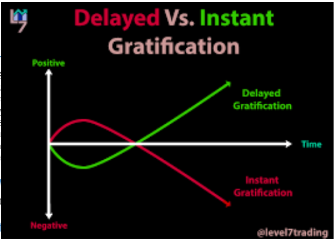
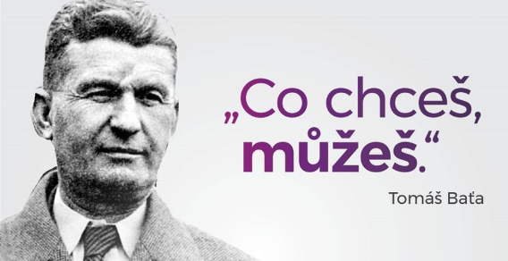

## Principles
### Dealing with the Changing World Order
[Principles for Dealing with the Changing World Order by Ray Dalio - YouTube](https://youtu.be/xguam0TKMw8)
- Everything happened in cycles
- When central banks print a lot of money, buy stocks, gold and commodities
- To understand what is coming at you, you have to understand what happened before you
## ⭐Zážitky
### Mikiny
- Research before
- Sítotisk nejlepší
- Koupit mikiny zvlášť od jiného dodavatele...levnější výroba
### Zoot objednávka
- Skvělé UI
- Přesná předpověď doručení
- Dárek zdarma
## 🙋 Lidi, podniky, projekty
### Simona Kijonková
- Dobrá služba v digitální ekonomice -> lidé si ji najdou (Product fit)
- Feedback je důležitý
- Co chce zákazník? Co ho trápí?
- Vydat MVP, aby vás nepředběhli, pak zlepšovat
### Tomáš Čupr
- 9/10 podniků ve 3 letech zkrachuje
- Zákazník na 1. Místě
- Inovace, kreativita
- Proč cokoliv dělám ([[S. Sinek Why?]])
### Grig
- Automatizace sníží cenu
### Jan Sláma
- Lehce vyslovitelný název
- Svéprávnost: business plán, aktuální příjem, minulé úspěchy, budoucí příjem, dokážu se uživit?
### Visualove
- Koníček, no profit -> reference
- Good enough, nejsou experti
###  Save the elephants (Nahrávka od Míši z JICu)
- Neztrácet naději, výsledky nepřijdou hned
- Dobrý tým, být v kontaktu s lidmi
- Špatné lidi pryč
- Vzdělání je důležité
- Being alone is OK
- Málo alkoholu
- Tančit (J. Peterson: Enjoy small things)
- Temporary stress, A. Kirby
- Být slušný
- Opočinek, spánek
  
  
### Tomáš Hoření
- Mít ochotu být nejlepší -> přijmu tě
- Být aktivní student (tvoření akcí)
- Podle reakcí poznáš jedinečný nápad
### Milionář mezi námi
- Věří v sen, vytrvalost
- Víra v sebe, utrácí za zážitky ne věci
- Má plán, nejde neexistuje, radost z chyb, peníze = svoboda
- Baťa: “Co chceš můžeš”
- Plán, velký sen (snílek)
- Hard work
  
  
## 📽️ Filmy
### The Founder
- Vyřešili problém, MVP -> zdokonalili (občas začali od začátku) - layout kuchyně
- Zákazník na 1. místě
- Vytrvalost + trpělivost = úspěch
- Dobrý tým, mindset, dobročinnost, občas risk
- Targetovat co nejvíce lidí (velký trh)
- Mít ambice
- Rychlý růst -> těžká kontrola -> dosadit správné a dobré lidí
- Essentialism, zaměření na best selling product
### Lord of War
Dělat to, co ti jde
### Pursuit of happyness
“Never let someone tell you, you can’t!”
“If you like something, go get it!”
“Hop on opportunities”
### Glengarry Glen Ross
- Command respect - fire someone - Sun Tzu
- Put all in, burn bridges - last person is fired - Sun Tzu