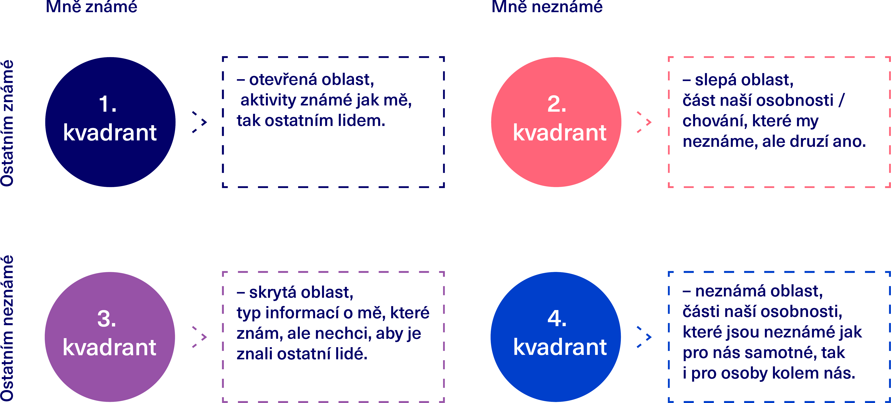
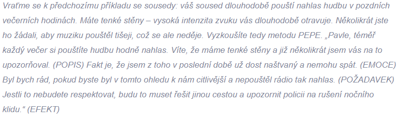
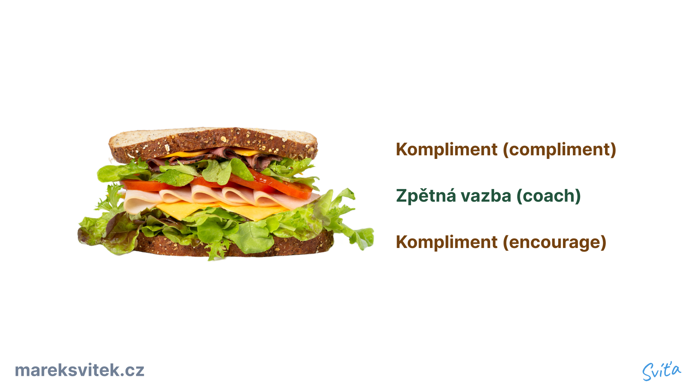
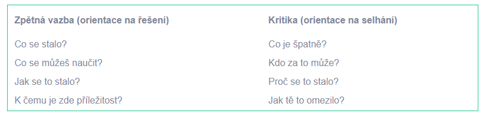

> [!tldr]
> Zpětná vazba je jako dárek, měl by být příjemný, užitečný a rozvojový.

## Naučená bezmocnost
- = pocit že nedokážu změnit svůj život, jsem demotivován
- Dá se jí přejít pomocí prevence:
	- Nahlížet na věci jako na stabilní a vůči nám vnitřní (námi ovlivnitelné)
	- Nenahlížet na věci jako na nestabilní a k nám vnější (námi neovlivnitelné)
	- *(Některé věci ale fakt neovlivníme, ale většinu ano)*

---

## Cíle a funkce zpětné vazby
1. Pro seberozvoj osob🎁
2. Pro změnu chování osoby 🔀

---

## 1. Pro seberozvoj 🎁
- ==**Vnímat feedback jako dárek**==
	- Jak ho dávám, ale také dostávám
	- Měl by to být proces příjemný, užitečný a rozvojový
- Pokud dostaneme jen neužitečnou **kritiku**, tak **vysvětlit**, že **z takové informace si nic nevezmu**
- Nejideálnější je vyžádaná zpětná vazba
- Johariho okno
	- Máme 4 kvadranty, zpětnou vazbou přesouváme věci ze slepé oblasti do otevřené oblasti
	- Mělo by to být i cílem, pokud už osoba zná danou věc, je to spíše zbytečný

---
## 2. Pro změnu chování 🔀
- 3 způsoby
	1. Labeling
	2. Shaping
	3. PEPE
### A. Labeling (Pygmalion efekt)
- Využívat jen v situacích, kdy jsem odborník, jinak použít shaping
- Upozorňovat na to, když to dělá špatně
- Závisí na tom kdo ji udělí
	- *Pokud například odborník diagnostikuje dítěti poruchu pozornosti, budete to pravděpodobně vnímat trochu jinak, než když se s vámi o tuto diagnózu podělí váš kamarád-laik jakožto o svou domněnku.*
- Využívá sebenaplňující předpovědi, Pygmalion efektu (=očekávání budoucích událostí vede k chování, které zapříčiní, že se daná skutečnost opravdu stane)
  
  .png)
  

### B. Shaping (positive reinforcement)
- Zaměříme na situace, kdy se dané osobě daří přibližovat ke kýženému chování
- Využívat když potřebujeme dosáhnout co nejpřesnějšího výsledku
	- Většinou jde o činnost, která je moc komplexní, aby člověk byl schopný naučit se ji celou najednou
- Prakticky funguje stejně jako trénovaní psa pomocí clickeru:
	- Odměna (pochvala/materiální) ve chvíli, kdy se nějakým způsobem přiblíží k ideálu/splní dílčí úkol
- Důležité i říct, která část úkolu:
	- je správně, co je tedy potřeba zachovat
	- a co je potřeba zlepšit (a jak toho dosáhnout)
- V praxi se využívá u psů a ve sportu
  
<iframe width="400" height="200" src="https://www.youtube-nocookie.com/embed/JA96Fba-WHk" title="YouTube video player" frameborder="0" allow="accelerometer; autoplay; clipboard-write; encrypted-media; gyroscope; picture-in-picture" allowfullscreen></iframe>

### C. PEPE
- Rychlejší cesta
- Kroky
	1. Popis
	2. Emoce
	3. Požadavek
	4. Efekt

1. Popis
	- Detailně popsat situaci z našeho pohledu
	- _„Trápí mě, že děláš… že neděláš… že práce vypadá takto, a ne takto…“_
2. Emoce
	- Vyjádříme co nás trápí na dané situaci a naše pocity
	- _„Trápí mě, že děláš… že neděláš… že práce vypadá takto, a ne takto…“_
3. Požadavek
	- Formulovat požadavek, návrh řešení
	- _„Trápí mě, že děláš… že neděláš… že práce vypadá takto, a ne takto…“_
4. Efekt
	- Jaké následky bude situace mít:
		- Pozitivní
			- Co nabízíte na oplátku nebo jaký pozitivní důsledek z toho plyne pro druhou stranu
		- Negativní
			- Co uděláte, pokud nedostanete to, co chcete
	- _„Trápí mě, že děláš… že neděláš… že práce vypadá takto, a ne takto…“_
	  

*Příklad hlasité hudby od sousedů*

---

## Jak by měla prakticky vypadat
### Sandwich Technique
- Celý proces je příjemnější

### Načasování
- Ihned - u zpětné vazby na znalosti, prezentace...
- Pozdějí - u zpětné vazby na emočně vypjatých situacích
- Příklad
	- _Pokud kolegovi oznámíte, že před týdnem něco na schůzi zapomněl zmínit, pravděpodobně to nebude mít žádný efekt.
	- _Podobně je vhodné nepředávat zpětnou vazbu ihned někomu, kdo je zcela očividně naštvaný, smutný nebo například nervózní. Počkejte, až bude emočně v lepším rozpoložení.

### Množství
- Nejpodstatnější key points, aby nebyl zahlcen
- _Zamyslete se i nad tím, jak „hluboko“ při zpětné vazbě jít. Je opravdu nutné probrat ihned všechno?

### Způsob
- Osobně
	- ==Nejúčinější je osobně==
	- Neverbální projevy
	- Může být nepříjemné dávat u negativního feedbacku, musíme volit vhodné věty
- Telefonicky
	- Dostupná jen intonace
- Písemně
	- Žádná neverbální komunikace
	- Použít emotikony pro odlehčení a lepší čitelnost

### Cílovka (komu ji dáváme)
- Kamarád/kolega/nadřízený/podřízený
- Žena(emoční)/muž(logický)
- Jak přijímá feedback?
- Pro nadřízeného - [How to Give Your Boss Feedback | HBR](https://hbr.org/2010/03/how-to-give-your-boss-feedback)

### Forma
- Formou otázky, praktické doporučení...

---

## Zpětnovazebný rozhovor
- 1 strana dává feedback, 2. dostává
- Struktura
	1. Začít od sebe
	2. Názor druhé strany a uvést příklady
	3. Vzájemná shodo
	4. Dohoda

- Podrobné kroky:
	1. Jak by se příjemce sám zhodnotil? Pokud má dobrou sebereflexi, tak je hotovo. (metoda lessons learned/debriefing)
	2. Pokud se náš názor liší, sdělíme názor s konkrétními příklady, ideálně i důsledky pokud se to bude opakovat
	3. Vzájemná shoda - pokud se neshodneme co by se mělo zlepšit/co bylo dobře
		- Zaparkovat feedback a vrátit se k němu později
		- Neshodu způsobují emoce/nedostatek informací/kognitivní zkreslení
	4. Dohoda - neodcházet než se neshodneme na tom co bude jinak
		- Ideální nabídnout pomoc/radu/oporu/školení...
		- Osoba musí vědět co je potřeba změnit a jak to příště udělat [Komunikace](../IT/Security/Komunikace.md)

---
## Konstruktivní x zbytečná kritika
- A. Zbytečná kritika
	- Zaměřená na selhání a co je špatně, hledání viníka/důvodu selhávní
	- Vnímáme danou situaci jako omezení, něco co nás neposouvá dál/nás brzdí
- B. Konstruktivní
	- Zaměřená na řešení, co se stalo, jak situace vypadala
	- Záleží nám co si můžeme odnést a naučit se, jak se to stalo pro poučení
	- Posouvá nás dál

---

## 10 zásad skvělé zpětné vazby
1. **Feedback orientovaný na charakteristiku situace ✅, ne osobnosti ❌**
	- _„Když se bavíme o této konkrétní prezentaci, tak…“ vs. „Jsi neschopný řečník.“_
2. **Formulovat jako možnost budoucího rozvoje 🔮✅, minulost už nezmění ⏱️❌**
	- _„Při příštím projektu se víc zaměř na rozdělení zodpovědností mezi jednotlivé členy projektového týmu“ vs. „V tom tvém projektu vůbec nebylo jasné, kdo má co na starosti…“_
3. **Konkrétní příklady**
	- _„Vaše prezentace byla trochu rozvleklá, když jste mluvil o příkladech. Zkuste příště uvést jen jeden příklad.“_
4. **Personalizace na jejich hodnoty**
	- Zaměřit se co je pro ně důležité, feedback je pro ně
5. **Akční rozvojový plán**
	- Kde je potřeba rozvíjet tak stanovit si akční plán
	- SMART cíl
	- Ideální pokud ho sestaví, ten co nám dal podnět
6. **Nezapomínat na positive reinforcement toho co se povedlo (shaping)**
	- Vyhnout se trestům, jsou méně efektivnější než odměny
7. **Lepší je když na to přijde sám, facilitovat, debriefing**
	- „Co myslíš, že jsi měl udělat v projektu jinak?
8. **Konstruktivní otázky**
	- _Za nejjednodušší strukturu pro debriefing můžeme považovat třeba tyto dvě otázky: „Co hodnotíš pozitivně na svém výkonu?“ a „Kde vidíš prostor pro tvůj rozvoj?“._
9. **Symetrie - když dávám, vyžádat si i feedback pro mě**
	1. _„Budu rád/a, když ty na oplátku povíš mně, co bych měl/a dělat jinak, aby se ti na příštím projektu se mnou lépe pracovalo.“_
	2. Zmenšuje i vzdálenost mezi podřízeným/nadřízeným
10. **Sledovat projevy (i neverbální) druhého, zda ho feedback vůbec zajímá/nebo je přehlcen**

---

## Oceňovat snahu, ne výkon (Growth Mindset)
- Oceněn za snahu („uspěl jsi, protože ses snažil“)
	- Případný neúspěch je zasáhl mnohem méně
	- Mindset *Příště se musím víc snažit*
	- Zvýší i snahu uspět víc
- Oceněn za schopnost („uspěl jsi, protože jsi šikovný“)
	- Mindset *nejsem tak dobrý, jak jsem si myslel*
	- Může snížit snahu, protože se bude bát aby o svou šikovnost nepřišel
- Vice o [growth mindset - víra ve změnu](Sebereflexe_-_Motivace.md#Growth_mindset_-_víra_ve_změnu)

---

## Nežádoucí efekty
- **Haló efekt**
	- Hodnotíme na základě prvního dojmu a né celkového výsledku
- **Efekt podobnosti sobě**
	- Tendence pozitivně posuzovat lidi s podobností (looks, názory, hodnoty...) k nám a negativně ostatní
- **Chyby v konstrastu**
	- srovnáváme zaměstnance s jinými zaměstnanci spíše než se specifickými standardy výkonnosti. Může se pak stát, že se juniorní kolegyně ohromně výkonnostně zlepšila, jen ji pořád porovnáváme s těmi seniorními a nedostatečně ji oceňujeme.
- **Chyba centrální tendence**
	- Vidíme všechny průměrně nebo blízko průměry a vynecháváme stupně hodnocení nadprůměru a podprůměrné
- **Chyby mírnosti nebo přísnosti**
	- Tendence všechny vnímat z jednoho konce škály
	- Způsobeno emočním naladěm, tehdy je lepší se vyhnout feedbacku
- **Obavy z ohrožení vlastní pozice**
	- Strach že někdo ohrozí naši pozici, proto nedoceňujeme nejshopnější podřízené jedince
	- Brzdíme svůj růst, ale i firmy
- **Zjednodušující vidění**
	- Zjednodušování složitých situací/příčin
	- Klesly roční tržby -> máme tendenci říct, že klesla produktivita, ale příčina může být i nová legislativa, poptávka...
	- Převážně u dětí, ale zůstává i částečně u dospělých
- **Konformita**
	- Neschopnost vystoupit proti skupině, přizpůsobování se všeobecným standardům, aby jsme nebyly černá ovce, ale zapadali
	- Tím i vzniká provozní slepota

---

## Jak ji přijmout
- Opět odpověď zní - vnímat jako dárek

<iframe width="460" height="220" src="https://www.youtube-nocookie.com/embed/FQNbaKkYk_Q" title="YouTube video player" frameborder="0" allow="accelerometer; autoplay; clipboard-write; encrypted-media; gyroscope; picture-in-picture" allowfullscreen></iframe>

- It's more about learning to take feedback
- Triggers
	- Truth trigger - *You're wrong, I'm perfect, I don't have imperfections.*
	- Relationship trigger - *Who are you to tell me.*
	- Identity trigger - emotional reaction to feedback
- Problems of being emotionally unsensitive
	- You won't remember it
	- You don't care about feedback
- Bad question - *Can you give me feedback?*
- Better questions - *What's 1 thing you see me doing, or failing to do, that is getting in my way. What's 1 thing I could change for improvement in this matter. What's 1 thing that would make a difference in our relationship.*

## Zdroje
- [Práce se zpětnou vazbou | Youniversity](https://youniversity.cz/modul/prace-se-zpetnou-vazbou)
